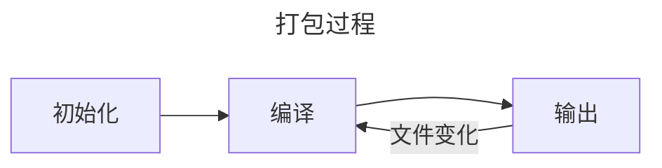

# 打包过程
了解 webpack 的打包构建过程有助于加深我们对 webpack 的理解，增加对其打包过程的掌控能力。

## 阶段
webpack 的构建流程可以分为以下 3 个阶段：
1. 初始化：启动打包构建，读取与合并配置参数，加载 plugin，实例化 compiler 对象。
2. 编译：从 entry 开始，对每个 module 都使用相应的 loader 进行分析处理，找出该 module 的依赖关系（即依赖的其他 module），再递归的对这些 module 进行处理，从而形成依赖关系图。
3. 输出：根据依赖关系图将相关的 module 处理转化为 chunk，再将 chunk 合成为 bundle，然后把 bundle 输出到文件系统中。
   

   
## 细节
下面将对 webpack 打包过程的 3 个阶段的细节进行介绍
### 初始化
初始化阶段会完成打包的前期准备工作，它们分别包括：
1. 初始化参数：从配置文件和控制台中读取参数然后合并，得出最终的参数。准备好配置文件中使用到的插件（即执行 `new Plugin()`）。
2. 实例化 compiler：使用上个步骤中得到的最终参数初始化 compiler 实例对象，compiler 负责文件监听和启动编译，它包含了 webapck 的完整的打包配置。（全局只有一个 compiler 实例）
3. 加载 plugin：按照顺序依次调用插件的 `apply()` 方法，让插件可以监听后续的所有事件节点。同时给插件传入 compiler 对象，以供插件能够通过 compiler 来调用 webpack 的 API。
4. environment：将 Node.js 的文件系统应用到 compiler 对象上，为后续的文件查找和读取做好准备。
5. entry-option：读取配置文件的 Entrys 设置 ，为每个 Entry 实例化一个 EntryPlugin，为后续该 Entry 的递归解析做好准备。
6. after-plugins：调用完成所有的默认的和配置的插件的 `apply()` 方法。
7. after-resolvers：根据配置文件初始化 resolver（在文件系统中负责解析和寻找相应路径下的文件）。 
   
### 编译
编译阶段会对将要打包的文件进行转换处理：
1. run：启动依次新的编译。
2. compile：告诉插件将要启动一次新的编译，同时将 compiler 对象传递给插件。
3. compilation：在开发模式下，每当 webpack 监听到文件内容发生变化，就会产生一次新的编译过程（即创建一个新的 compilation 对象），该对象中包含了当前的模块资源，编译生成的资源以及发生变化的文件等。同时该对象也提供了一些回调供插件扩展。
4. make：当上一步骤中的 compilation 对象创建完成后，就将从 Entry 开始读取文件，根据读取到的文件类型使用相应的 loader 进行处理转换，处理完成后再找出该文件所依赖的其他文件，然后递归的进行上述处理。
5. after-compile：一次 compilation 执行完成。
6. invalid：当在编译过程中遇到文件不存在或者编译错误的情况会触发该事件，但不会导致 webpack 退出编译过程。
7. watch-run：启动监听模式，当监听到文件发生变化后会重新启动一次新的编译（run）。  
   
在编译阶段的几个步骤中，compilation 是其中最为核心的一个阶段，它由许多更小的任务组成：
* build-module：使用对应的 loader 去处理转换模块。
* normal-module-loader：当使用 loader 转换处理完一个模块后，就会生成对应的抽象语法树（AST），在此时可以进行 tree-shaking（即剔除无用的代码，保留有用的代码）。
* program：从配置的 Entry 开始，分析其 AST，当遇到 `require()` 等其他导入语句时，将其加入到依赖的模块列表，同时对新找出的模块递归的进行依赖分析，最终生成内部依赖图。
* seal：所有的模块及其依赖的模块都通过 loader 解析转换完成后，根据依赖关系生成 chunk。
     
### 输出
输出阶段会将编译阶段处理完成的模块按照依赖关系组合成 chunk，再将 chunk 组合成最终产物 bundle 并输出到文件系统中：
1. should-emit：所有需要输出的文件已经生成，判断哪些文件需要输出，哪些不需要。
2. emit：在确定好要输出的文件后，将文件输出，在此时可以获取和修改输出的内容。
3. after-emit：文件输出完成。
4. done：完成一次编译和输出的流程。
5. failed：如果 webpack 在编译或者输出流程中遇到异常导致退出时，会直接跳转到 failed 步骤，此时插件可以在此步骤中获取到具体的异常信息。
   
在经过以上的 3 个打包阶段后，完成一次打包构建的流程，webpack 会在指定的输出目录下生成最终的打包结果文件以供浏览器使用。

<Minfo>

更多关于 webpack 打包的信息请查看：[webpack 中文文档](https://webpack.docschina.org/)

</Minfo>