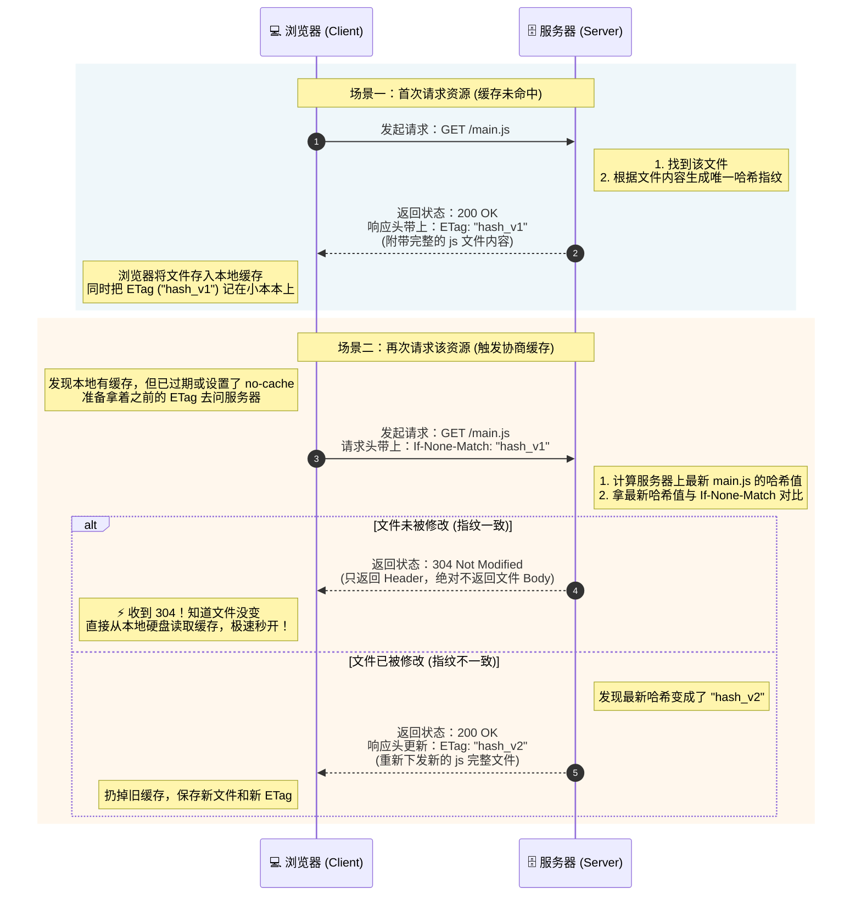

太好了！第三篇文章可以说是整个 HTTP 系列中最贴近前端工程师日常开发、最“硬核”、也是面试最爱问的部分。

理解了 HTTP 首部字段（Headers），你就不再只是一个“只会调接口”的切图仔，而是能够掌控缓存优化、解决跨域报错、设计安全鉴权方案的高级前端。

这篇草稿我采用了**分类解析+真实场景**的结构，帮助读者（包括你自己）将枯燥的理论与日常 Bug 联系起来。

---

# HTTP 首部字段

> **引言**
> 在上一篇《解剖 HTTP 报文与前端必懂的状态码指南》中，我们把 HTTP 报文比作了一封信，并破译了信件状态码的含义。
> 
> 但这封信能不能寄到？信封里的内容是否安全？收件人下次还要不要再收一遍同样的信？这些决定前端生死的关键问题，全都由写在信封上的**首部字段（Headers）**来控制。
> 
> 今天，我们就来盘点那些前端每天都要打交道、却经常让人摸不着头脑的核心 HTTP 首部字段。掌握它们，你就能轻松解决跨域（CORS）、精准控制缓存、并构建安全的身份验证。

## 一、 首部字段到底是什么？

首部字段（Headers）是 HTTP 报文中最灵活的部分。它们是由 `字段名: 字段值` 组成的键值对（例如 `Content-Type: application/json`）。

根据作用域的不同，HTTP 将首部字段划分为四大类：
1.  **通用首部 (General Headers)**：请求和响应都可以用。
2.  **请求首部 (Request Headers)**：只有前端发给后端时用。
3.  **响应首部 (Response Headers)**：只有后端发给前端时用。
4.  **实体首部 (Entity Headers)**：专门用来描述报文主体（Body）的信息（比如内容大小、格式）。

这听起来像教科书一样枯燥，对吧？别急，我们不背概念，直接看前端开发中最痛、最核心的三个实战场景！

---

## 二、 场景一：数据格式与身份认证（请求头篇）

每次用 Axios 或 Fetch 发请求，你其实都在默默配置这些字段。

### 1. 我发的是什么？（Content-Type）
*   **所属分类**：实体首部
*   **前端痛点**：如果你发了 POST 请求，数据传到了后端，但后端老哥说：“你传的是空的！”大概率是你忘记设置，或者设置错了 `Content-Type`。
*   **常见值**：
    *   `application/json`：现代前后端分离最常用的格式，告诉后端我发的是 JSON 字符串。
    *   `application/x-www-form-urlencoded`：传统的表单提交格式（`key1=value1&key2=value2`）。
    *   `multipart/form-data`：用于**上传文件/图片**。浏览器会自动帮你设置这个头，并生成一个特殊的 `boundary` 边界符。

### 2. 我想要什么？（Accept）
*   **所属分类**：请求首部
*   **作用**：前端告诉服务器：“我只能看懂这些格式，请尽量返回我认识的。”
*   **常见值**：`application/json`, `text/html`, `*/*` (啥都行)。

### 3. 我是谁？证明给你看！（Authorization）
*   **所属分类**：请求首部
*   **实战应用**：**JWT (JSON Web Token) 鉴权的核心**。当用户登录成功拿到 Token 后，前端需要在后续每次请求中带上它。
*   **标准写法**：在 Axios 的请求拦截器中加上 `Authorization: Bearer <你的Token>`。后端只要看到这个头，就知道你是合法用户。

---

## 三、 场景二：前端性能优化的核武器 —— 缓存控制（通用头篇）

为什么大厂的网页能“秒开”？为什么老板让你改个 Bug 上线后，用户抱怨说“页面还是旧的”？这一切都归功于（或怪罪于）HTTP 缓存。

缓存分为**强缓存**和**协商缓存**。

### 1. 强缓存的绝对王者：Cache-Control
*   **作用**：控制资源在本地浏览器存活的时间，最彻底的性能优化。
*   **常见指令（必须死记硬背）**：
    *   `max-age=3600`：强缓存 1 小时。在这 1 小时内，浏览器**绝不会**发网络请求，直接从内存/硬盘读取，速度极快（状态码 200 from disk cache）。
    *   `no-cache`：**大坑预警！** 它不是“不缓存”，而是“可以存，但每次用之前**必须去服务器问一下**有没有更新”（即强制走协商缓存）。
    *   `no-store`：真正的“绝对不缓存”，常用于包含机密的金融数据。

### 2. 协商缓存的探路者：ETag 与 Last-Modified
当强缓存过期（或设置了 `no-cache`），浏览器必须发请求问服务器：“这文件变质了吗？”

*   **方案 A（老旧）：基于时间的 Last-Modified**
    *   服务器响应：`Last-Modified: 星期二`（文件最后修改时间）。
    *   前端下次请求带上：`If-Modified-Since: 星期二`（问：星期二之后改过吗？）。
    *   **缺点**：只能精确到秒，如果不小心修改了文件但内容没变，缓存也会失效。
*   **方案 B（现代）：基于内容指纹的 ETag**
    *   服务器响应：`ETag: "v1.2-hash123"`（文件内容的哈希值）。
    *   前端下次请求带上：`If-None-Match: "v1.2-hash123"`（问：现在的指纹还是这个吗？）。
    *   **完美结局**：如果文件没变，服务器只返回一个空壳响应，状态码 **`304 Not Modified`**，极大地节省了下载大文件的带宽。
  

### 3. 缓存控制示意图

> **💡 前端架构最佳实践 (Cache Busting)：**
> 我们通常将 `index.html` 设置为 `no-cache`（永远协商最新），而将打包生成的 JS/CSS 文件名加上 Hash（如 `main.a7b9c.js`），并设置长达一年的强缓存 `max-age=31536000`。
> 当代码更新时，JS 文件名变了，HTML 引用了新路径，浏览器自然会去下载新文件，完美实现“平滑更新，极致缓存”！

---

## 四、 场景三：前端最臭名昭著的报错 —— CORS 跨域（响应头篇）

`Access to XMLHttpRequest at '...' from origin '...' has been blocked by CORS policy.`
看到这行红字，无数前端新手都会虎躯一震。这就是浏览器的**同源策略**在保护你，但它也拦住了正常的请求。

解决跨域（CORS）的核心，在于**后端的响应头**。前端虽然改不了，但必须懂，这样才能硬气地把锅甩给后端！

### 1. 跨域通行证：Access-Control-Allow-Origin
*   **作用**：服务器告诉浏览器，允许哪个源（协议+域名+端口）来读我的数据。
*   **配置**：可以写 `*`（允许所有人，但不安全），也可以写具体的 `http://localhost:3000`。

### 2. 复杂请求的“探路保安”：OPTIONS 预检请求
当你的请求属于“复杂请求”（例如带了自定义 Header，或者 `Content-Type` 是 `application/json` 时），浏览器怕你做坏事，会**自动**先发一个 `OPTIONS` 请求去问服务器：“我能发 JSON 吗？”

这时候，服务器必须返回三个头来放行：
*   `Access-Control-Allow-Methods`：允许的方法（如 POST, PUT）。
*   `Access-Control-Allow-Headers`：允许带的请求头（如 Content-Type, Authorization）。
*   `Access-Control-Max-Age: 86400`：**性能优化点！** 告诉浏览器这个“放行条”在 24 小时内有效，下次发 POST 就别再发 OPTIONS 问了，直接发吧！

---

> **结语**
> HTTP 首部字段就像是一个庞大的开关控制台，决定了 Web 应用的性能、安全与兼容性。
> 
> *   遇到“参数收不到”，检查 `Content-Type`。
> *   遇到“页面没更新”，检查 `Cache-Control`。
> *   遇到“鉴权失败”，检查 `Authorization`。
> *   遇到“跨域红字报错”，检查 `Access-Control-Allow-*` 系列。
> 
> 只要掌握了这些核心 Headers，你就能在网络调试时拥有“透视眼”。

---
