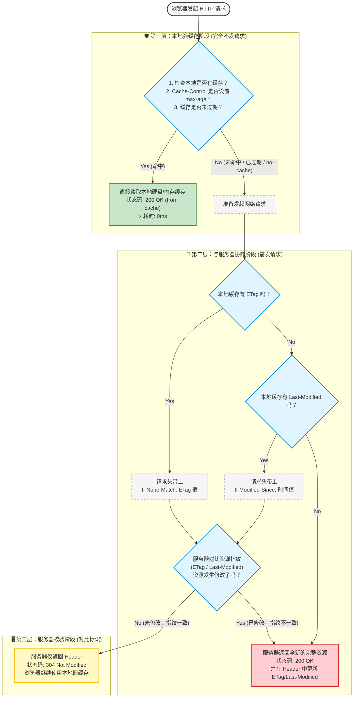

# HTTP 缓存策略

> **引言**
> 如果有人问你：“如何让一个加载需要 3 秒的网页，变成 0.1 秒秒开？”
> 压缩代码、懒加载、使用 CDN……这些都很重要。但最立竿见影、最暴力的手段永远只有一个：**不发请求，直接读缓存**。
>
> HTTP 缓存机制是前端性能优化的基石。理解了它，你不仅能让网页飞起来，还能彻底明白为什么我们打包出来的 JS 文件名总是带着一串奇怪的 Hash 字符（如 `main.a7b9c.js`），以及为什么用户总是在群里抱怨“老板，我看到的页面还是昨天那个旧的！”
>
> 今天，我们就来彻底扒开 HTTP 缓存的底裤，搞懂**强缓存**与**协商缓存**的爱恨情仇。

---

## 一、 缓存的本质：一场不问服务器的“自嗨”

为了通俗易懂，我们把客户端（浏览器）请求资源，比作**去超市买牛奶**。

*   **没有缓存**：你每次想喝牛奶，都要走路 20 分钟去超市（发请求），付钱买一盒新的（下载文件），回家喝。慢且费钱（浪费服务器带宽）。
*   **有缓存**：你买了一箱牛奶放在家里的冰箱。下次想喝，直接打开冰箱拿出来就行。快且省钱！

HTTP 缓存就是浏览器的“冰箱”。它分为两层机制，层层递进：

1.  **第一层：强缓存（Strong Cache）** —— “保质期内，我自己决定直接喝。”
2.  **第二层：协商缓存（Negotiated Cache）** —— “好像过期了？我打个电话问问超市这牛奶还能不能喝。”

---

## 二、 第一层防御：强缓存（绝不麻烦服务器）

强缓存是最极致的优化。当浏览器发现本地缓存的资源还没过期时，它会**直接阻断网络请求**，从内存 (Memory Cache) 或硬盘 (Disk Cache) 中读取文件。
此时，你在 Network 面板看到的请求状态码是 **`200 OK`**，但时间通常只有 0 毫秒或 1 毫秒。

控制强缓存的，是两个 HTTP 响应头（按历史演进顺序）：

### 1. 过去的王者：`Expires` (HTTP/1.0)
*   **长什么样**：`Expires: Wed, 25 Oct 2023 10:00:00 GMT`
*   **原理**：服务器告诉你一个**绝对的过期时间**。在这个时间点之前，浏览器直接用缓存。
*   **致命缺陷**：它依赖于**客户端的本地时间**！如果用户的电脑时间不准（比如调慢了一天），或者时区不同，缓存机制就直接崩溃了。因此，它现在基本被淘汰。

### 2. 现代的绝对核心：`Cache-Control` (HTTP/1.1)
为了解决时间不准的问题，HTTP/1.1 推出了 `Cache-Control`，它使用的是**相对时间**。
*   **长什么样**：`Cache-Control: max-age=31536000`
*   **原理**：`max-age` 的单位是**秒**。上面这句的意思是：“从拿到这个文件开始算，**未来 365 天内（即一年）**，都直接用缓存！”不管你本地时间怎么乱跳，倒计时一年的逻辑是绝对不会错的。
  

### 3. 强缓存与协商缓存示意图

> **⚠️ 前端必考坑点：`no-cache` 与 `no-store` 的区别**
> 面试官最爱问：“如果我不想让浏览器缓存，应该设置什么？”
> *   如果你回答 `no-cache`，那就掉坑里了！**`no-cache` 的真实含义是：跳过强缓存，每次必须去服务器验证（强制走下面的协商缓存）！** 它其实是允许缓存的，只是不敢直接用。
> *   正确的答案是 **`no-store`**。这才是真正的“绝对不缓存”，浏览器连冰箱门都不会开，每次老老实实去超市买新的。适用于涉及机密的金融数据。

---

## 三、 第二层防御：协商缓存（打个电话确认一下）

如果强缓存过期了（或者设置了 `no-cache`），浏览器不敢直接用本地的文件了。怎么办？
扔掉重新下载吗？太浪费了！万一服务器上的文件根本没改过呢？

这时候，浏览器会带着本地文件的“生产批号”，向服务器发一个极小的验证请求，这就是**协商缓存**。

如果服务器对比批号后，发现文件**没改过**，就会返回一个神奇的状态码：**`304 Not Modified`**。
注意，`304` 的响应体（Body）是**空**的！服务器的意思是：“没变质，放心喝吧，我就不重新给你发一盒了。” 浏览器立刻开心去冰箱拿旧文件用。

协商缓存有两套配对的 Header 机制：

### 方案 A：基于时间的 `Last-Modified`（较老）
*   **初次获取**：服务器返回文件时，带上 `Last-Modified: 星期一 10:00`（这文件的最后修改时间）。浏览器把文件和这个时间一起存起来。
*   **再次验证**：浏览器发请求，带上头 `If-Modified-Since: 星期一 10:00`（问：自从星期一之后，这文件改过吗？）。
*   **缺陷**：
    1.  只能精确到**秒**。如果你在 1 秒内改了两次文件，浏览器会认为没改，继续用旧缓存。
    2.  有时候你只是重新打开保存了文件（时间变了），但内容根本没变，服务器也会傻乎乎地重新下发大文件，导致 304 失效。

### 方案 B：基于内容指纹的 `ETag`（现代、精准）
为了解决时间的精度问题，HTTP/1.1 引入了 ETag。
*   **初次获取**：服务器通过哈希算法，对文件**内容**生成一段唯一的指纹，返回 `ETag: "v1.2-hash123"`。
*   **再次验证**：浏览器发请求，带上头 `If-None-Match: "v1.2-hash123"`（问：你现在的指纹还是这串字符吗？）。
*   **优势**：绝对精准！只要文件内容改了哪怕一个标点符号，哈希值就会突变，服务器立马返回 `200` 和新文件。内容没变，就永远是 `304`。

*(注：如果两者同时存在，服务器会优先验证 `ETag`)*。

---

## 四、 终极实战：现代前端工程化是如何利用缓存的？

懂了原理，我们来看看 Webpack / Vite 配合 Nginx 是如何打出一套“无懈可击”的缓存组合拳的。这也是被称为 **Cache Busting（缓存破坏）** 的高级技巧。

**我们的痛点**：
如果把所有文件都设置强缓存一年（`max-age=31536000`），速度是快了。但如果老板让你紧急修复一个 Bug 上线，用户的浏览器未来一年内都不会去请求新代码，他们看到的永远是有 Bug 的旧页面！

**完美解法（分而治之）：**

### 1. HTML 文件：绝不强缓存，永远协商最新！
我们在 Nginx 上专门针对 `index.html` 设置：
`Cache-Control: no-cache`（或者较短的 `max-age`）。
*   **效果**：每次用户打开你的网址，浏览器**必须**去服务器验证 HTML 有没有更新。

### 2. 静态资源 (JS/CSS/图片)：永久强缓存 + Hash 命名！
我们在构建工具（Vite/Webpack）打包时，给所有 JS/CSS 文件名加上根据文件内容生成的 Hash 值（如 `main.a7b9c.js`）。
然后在 Nginx 上对这些静态资源设置：
`Cache-Control: max-age=31536000`（强缓存 1 年）。

### 3. 神奇的化学反应发生了：
*   **平时访问**：HTML 瞬间走完 `304` 协商缓存，JS/CSS 彻底被强缓存拦截（`200 from disk cache`），不发网络请求。页面秒开！
*   **紧急发版**：
    1. 你改了 Bug 重新打包，JS 文件名因为内容变了，Hash 突变，变成了 `main.f8d2e.js`。
    2. 新的 `index.html` 里引用的变成了 `<script src="main.f8d2e.js">`。
    3. 用户刷新页面 -> HTML 因为是 `no-cache`，强制拉取到了最新的 HTML -> 浏览器解析发现需要 `main.f8d2e.js` -> 本地冰箱里只有旧的 `a7b9c`，没有新文件 -> **完美跳过强缓存，向服务器下载了最新的 Bug 修复代码！**

---

> **结语**
> HTTP 缓存看似是一堆枯燥的 Header 字段，但当我们把它与前端工程化结合在一起时，你会发现它是一门极其精妙的艺术。
> 
> **总结一句心法：**
> 频繁变动的文件（如 HTML），用 `no-cache` 配合 `ETag` 走**协商缓存**，保证绝对实时；
> 内容固定的静态资源（如带 Hash 的 JS/图片），用 `max-age=一年` 走**强缓存**，榨干性能最后一滴血。

---
