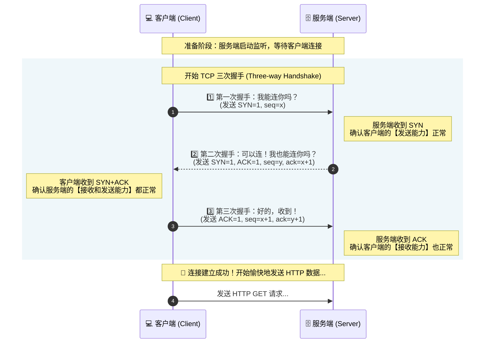
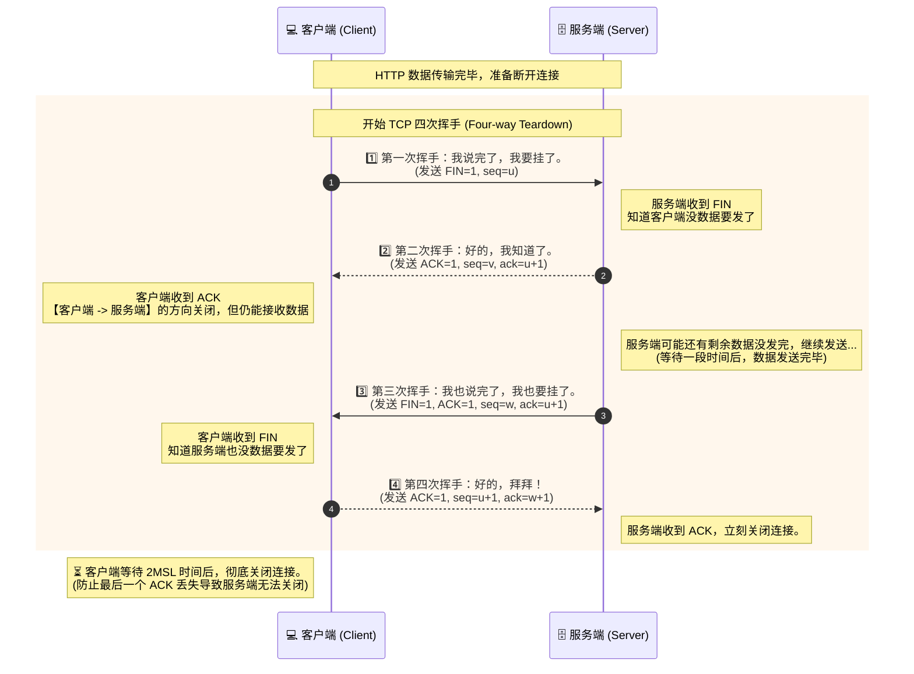

# 传输层协议 (TCP 与 UDP)

> **引言**
> 在前面的系列文章中，我们把 HTTP 协议扒了个底朝天。
> 但你有没有想过，HTTP 其实只是一个“发号施令”的老板（应用层），它只负责规定包裹里装什么（HTML/JSON），却从来不亲自送快递。
> 
> 真正风里雨里穿梭在光缆和路由器之间，把数据从你的电脑搬运到服务器的，是底层两位性格迥异的快递员：**TCP** 和 **UDP**（传输层）。
> 
> 很多前端觉得底层网络协议太抽象，跟自己没关系。但当你遇到 WebSocket 断线、视频直播卡顿、或者 HTTP/2 的性能瓶颈时，答案往往就藏在它们身上。
> 今天，我们就来详细扒一扒 TCP 与 UDP 的底层机制与核心差异。

---

## 一、 一秒看懂核心差异：打电话 vs 寄明信片

在深入技术细节前，我们先用两个生活场景来定调：

*   **TCP 就像“打电话”**：
    *   拨号，对方接听，确认双方都能听见（**建立连接**）。
    *   你一句我一句，如果对方没听清，你会重复一遍（**可靠传输、丢包重传**）。
    *   说完后，双方礼貌互道再见，挂断电话（**释放连接**）。
    *   **特点**：极其靠谱，但建立连接很慢，沟通成本高。

*   **UDP 就像“寄明信片”**（或者村口的大喇叭广播）：
    *   你在明信片上写好地址，直接扔进邮筒（**无连接**）。
    *   你根本不知道对方收没收到，哪怕明信片掉进下水道了，你也不管（**不可靠**）。
    *   **特点**：极其快速，不管死活，发了就完事。

---

## 二、 严谨的老实人：TCP (传输控制协议)

**TCP (Transmission Control Protocol)** 是互联网上使用最广泛的协议。**我们之前学过的 HTTP（1.1和2.0）、WebSocket，底层全都是 TCP。**

它的核心使命只有一个：**宁可慢一点，也绝对不让数据丢失、错乱。**

### 1. 核心机制：面试必考的三次握手与四次挥手
TCP 想要保证可靠，就必须在发数据之前，先确认网络通道是通畅的。

**🤝 建立连接：三次握手 (Three-way Handshake)**
为了防止旧的无效连接请求突然传到服务器产生误会，TCP 必须进行三次通信来确认身份：
1.  **客户端**：“喂，能听到我说话吗？”（发送 `SYN` 报文，请求建立连接）
2.  **服务端**：“我能听到！那你能听到我说话吗？”（发送 `SYN + ACK` 报文，同意连接并反问）
3.  **客户端**：“我也能听到！那我们开始发数据吧。”（发送 `ACK` 报文，确认收到）
*(完成这三步，TCP 连接才算真正建立，之后 HTTP 才能开始发请求)*。

**👋 断开连接：四次挥手 (Four-way Teardown)**
因为 TCP 是全双工的（双方可以同时发数据），所以断开时必须两边都明确表示“我发完了”。
1.  **客户端**：“我要说的话全都说完了，我想挂了。”（发 `FIN`）
2.  **服务端**：“好的，我知道了，但我还有点数据没传完，你再等一下。”（发 `ACK`）
3.  **服务端**（过了一会儿）：“我的数据也传完了，可以挂电话了。”（发 `FIN`）
4.  **客户端**：“好的，再见！”（发 `ACK`。客户端等一会儿没回复，彻底关闭连接）。

### 2. TCP 的看家本领：可靠性保证
除了握手，TCP 在传输过程中还做了极其繁重的工作：
*   **按序到达**：把大文件切成小块（报文段），编上序号。即使网络导致乱序，接收端也能按序号拼好。
*   **超时重传**：发一个包，启动一个定时器。如果规定时间内没收到对方的 `ACK` 确认，TCP 就认为包丢了，**强制重新发一次**。
*   **拥塞控制 (Congestion Control)**：如果网络很卡，TCP 会主动把发送速度降下来，防止网络彻底瘫痪。

### 3. 致命痛点：TCP 队头阻塞
还记得我们在 HTTP/2 那篇文章里提到的痛点吗？
因为 TCP 太老实了，它规定**数据必须按顺序交给应用层**。如果第 2 个包在路上丢了，哪怕第 3、4、5 个包早就到了，TCP 也会把它们死死扣留在操作系统的缓冲区里，直到第 2 个包重传成功。这就是万恶的 **TCP 层队头阻塞**，也是 HTTP/2 性能受限的元凶。

---

## 三、 莽撞的飙车党：UDP (用户数据报协议)

**UDP (User Datagram Protocol)** 的设计哲学与 TCP 完全相反：**天下武功，唯快不破。**

### 1. 核心特征：无连接、不可靠
*   **没有握手**：UDP 不管三七二十一，拿到数据，套上目的 IP 和端口，直接往网络里塞。毫无建连延迟。
*   **不保证交付**：UDP 发出去的包，就像泼出去的水。丢包了？不管。顺序乱了？不管。
*   **没有拥塞控制**：哪怕网络已经挤成一锅粥了，UDP 依然会按照你设定的速度疯狂发包。

### 2. 为什么我们需要这么“烂”的协议？
看到这里你可能会问，这么不可靠的协议，留着过年吗？
恰恰相反，在某些对**实时性要求极高**的场景，TCP 的“可靠”反而成了致命伤。

*   **场景一：视频直播 / 微信视频通话 (实时音视频 WebRTC)**
    如果用 TCP，一旦网络卡顿丢了一个视频帧，TCP 就会死等重传，导致你的视频画面卡死 3 秒。
    如果用 UDP，丢了一帧就丢了，大不了屏幕上出现一点马赛克，但视频绝对是**流畅且实时**的。对于直播来说，0.1秒的马赛克绝对比卡顿 3 秒要好得多。
*   **场景二：多人在线竞技游戏 (FPS/MOBA)**
    你玩《王者荣耀》按了一个闪现。如果包丢了，TCP 重传这个操作，等 1 秒后服务器收到，你早就被击杀了。游戏通常底层使用 UDP，结合自己的应用层算法来保证极致的低延迟。
*   **场景三：DNS 域名解析**
    DNS 只是发一个极小的包去问“baidu.com 的 IP 是多少”。为了这么点数据去搞复杂的三次握手太浪费了，UDP 一去一回瞬间搞定。

---

## 四、 巅峰对决：TCP vs UDP 核心对比

这张表格是面试中最常被问到的，请务必刻在脑子里：

| 维度 | TCP | UDP |
| :--- | :--- | :--- |
| **连接状态** | **面向连接** (必须先三次握手) | **无连接** (直接发) |
| **可靠性** | **绝对可靠** (不丢包、不乱序) | **不可靠** (尽最大努力交付) |
| **传输效率** | **慢** (有握手和重传等沉重开销) | **极快** (头部只有 8 个字节，0开销) |
| **数据传输形式** | 面向**字节流** (粘包问题) | 面向**报文** (保留消息边界) |
| **前端相关应用** | **HTTP/1.1, HTTP/2, WebSocket** 下载文件、发邮件、常规网页接口 | **WebRTC** (音视频通话) DNS 解析、HTTP/3 |

---

## 五、 历史的轮回：HTTP/3 与 UDP 的联姻

文章的最后，我们让知识产生闭环，回到我们的 HTTP 系列。

既然 TCP 如此可靠，UDP 如此快速，那能不能把两者的优点结合起来呢？
**能！这就是 Google 推出的 QUIC 协议，也就是 HTTP/3 的底层基石。**

既然 TCP 的底层代码写死在操作系统的内核里，改不动了。谷歌的工程师干脆**抛弃了 TCP，底层直接使用 UDP**。
然后，他们在 UDP 之上（应用层内部）用代码自己实现了一套类似 TCP 的丢包重传机制。

**HTTP/3 (QUIC) 的神仙操作：**
1.  **0-RTT 建连**：利用 UDP 的无连接特性，首次握手极快，再次连接甚至不需要握手时间。
2.  **彻底消灭队头阻塞**：因为底层是 UDP，没有 TCP 那套“按序交付”的死板规定。如果发了 10 张图片，第 2 张丢了，只有第 2 张的流会等待重传，其他 9 张图片直接交给前端渲染！

兜兜转转三十年，原本被嫌弃“不可靠”的 UDP，最终成了拯救 HTTP 性能瓶颈的超级英雄。

## 五、TCP连接示意图

### 1. 三次握手建立连接

### 2. 四次挥手断开连接

> **结语**
> TCP 就像一位严谨的老管家，确保我们发出的每一个 JSON、每一张图片都完好无损地抵达；
> UDP 就像一位狂野的赛车手，在视频直播和游戏的赛道上追求着极致的低延迟。
> 
> 了解传输层，不仅是为了应付面试中的“三次握手”，更是为了让我们在面对业务架构选型时，能够根据“要可靠还是要速度”，做出最正确的判断。
> 
> 在 Node.js 中，如果你想直接玩 TCP，用的是 `net` 模块；如果你想玩 UDP，用的是 `dgram` 模块。

---
