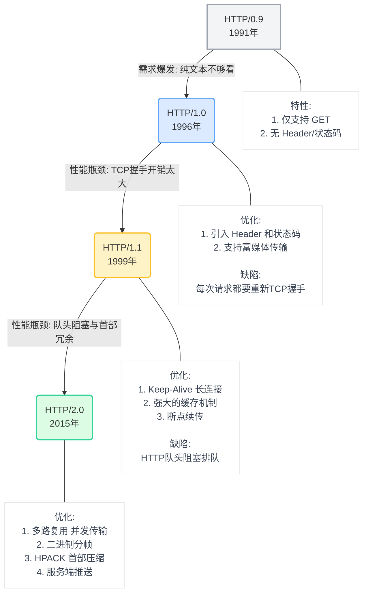

# 万维网基石之HTTP

> **引言**
> 作为一名前端开发工程师，我们每天都在和 `axios`、`fetch` 打交道，每天都在浏览器的 Network 面板里抓包。但剥开 Vue/React 的华丽外衣，前端与后端沟通的真正桥梁，其实是底层默默工作的 HTTP 协议。
> 为了突破技术瓶颈，我近期系统地重温了 HTTP 相关的网络知识，并决定写成系列文章记录下来。本文是系列的第一篇，让我们先从宏观视角，重新认识一下这位熟悉又陌生的老朋友——HTTP。

## 一、 到底什么是 HTTP？

HTTP 的全称是 **HyperText Transfer Protocol（超文本传输协议）**。
初看这三个词组有点抽象，我们不妨把它拆开来理解：

1.  **协议 (Protocol)**：
    可以理解为“规矩”或“暗号”。如果前端讲中文，后端讲火星文，双方是无法沟通的。HTTP 就是计算机世界里，客户端（浏览器）和服务器之间约定好的一种“标准沟通语言”。
2.  **传输 (Transfer)**：
    HTTP 是一个双向的搬运工。它负责把数据从 A 点（服务器）安全、准确地搬运到 B 点（浏览器），反之亦然。
3.  **超文本 (HyperText)**：
    早期的互联网只能传输纯文字。但现在的网页有图片、视频、超链接、CSS 样式、JS 脚本。这些超越了普通文本格式的数据，统称为“超文本”。

**👉 一句话总结：**
HTTP 就是一个在计算机世界里，专门用来在两点之间传输文字、图片、音频、视频等超文本数据的**约定和规范**。

## 二、 HTTP 的核心作用与工作模式

如果把互联网比作一家大型餐厅，那么：
*   **浏览器（前端）** 是点餐的顾客。
*   **服务器（后端）** 是后厨的厨师。
*   **HTTP** 就是穿梭在两人之间的**服务员**。

HTTP 永远遵循着一个最基本的工作模式：**请求与响应（Request & Response）**。

1.  **请求 (Request)**：顾客叫服务员过来，递上菜单：“我要一份番茄炒蛋（`GET /tomato-egg`），不要放葱（`Headers`）”。
2.  **响应 (Response)**：服务员去后厨把菜端出来，放在你桌上：“您的菜齐了（`状态码 200 OK`），这是您的番茄炒蛋（`Body`）”。

**对于我们前端工程师来说，HTTP 的作用无处不在：**
*   用户在浏览器地址栏敲下 URL 按下回车，靠 HTTP 拿回 HTML 页面。
*   页面解析时遇到 `` 或 `<script>`，靠 HTTP 加载静态资源。
*   用户在表单点击“提交登录”，靠 HTTP 把账号密码发送给后端验证。
*   我们遇到令人头疼的跨域报错（CORS）、缓存不更新、页面白屏加载慢，本质上都是 HTTP 层面的问题。

## 三、 HTTP 的前世今生（发展进化史）

HTTP 并不是一诞生就这么完美的。它的演进史，本质上就是一部**“与网络延迟做斗争、满足网页日益复杂需求”**的进化史。了解它的历史，你就能明白前端很多优化手段（如雪碧图、打包合并）是怎么来的，又是怎么被淘汰的。

---

### 1. HTTP/0.9（1991年）：纯文本时代的“原型机”

这是万维网诞生初期的极简版本，当时的网页只有纯文本，没有图片，没有复杂的样式。

*   **特性与规定**：
    *   **只有一个方法**：只支持 `GET` 方法。
    *   **没有首部（Header）**：请求就是简单的一句 `GET /index.html`，没有其他任何附加信息。
    *   **没有状态码**：服务器处理完直接把 HTML 纯文本扔给浏览器，如果出错了，就发一段包含错误信息的 HTML 文本。
    *   **只能传 HTML**：不支持其他格式的文件。
*   **通信过程**：建立 TCP 连接 -> 客户端发送 GET -> 服务端返回 HTML 文本 -> **立刻断开 TCP 连接**。

---

### 2. HTTP/1.0（1996年）：现代 Web 的“奠基者”

随着浏览器的发展，人们不满足于纯文本，想要看图片、听音乐、提交表单。HTTP/0.9 完全不够用了，于是 HTTP/1.0 诞生，确立了现代 HTTP 的基本骨架。

*   **新增核心特性**：
    *   **引入了首部（Headers）**：这是跨时代的进步！请求和响应都可以携带元数据了（比如 `Content-Type` 说明文件类型，`User-Agent` 说明浏览器身份）。
    *   **引入了状态码（Status Code）**：加入了 200、404、500 等，让浏览器知道请求的结果是什么。
    *   **支持多种方法**：增加了 `POST` 和 `HEAD`。
    *   **支持多媒体传输**：得益于首部的 `Content-Type`，不仅能传 HTML，还能传图片、视频、二进制文件了。
*   **它的痛点（为什么被淘汰？）**：
    *   **短连接（Short Connection）**：HTTP/1.0 规定，**每次发起一个 HTTP 请求，都必须重新建立一次 TCP 三次握手**，请求结束后立刻进行四次挥手断开。
    *   *后果*：如果一个网页有 10 张图片，浏览器就要和服务器建立 10 次 TCP 连接，握手和挥手的网络开销极其巨大，页面加载非常缓慢。

---

### 3. HTTP/1.1（1997年发布，1999年完善）：统治互联网的“老黄牛”

为了解决 HTTP/1.0 性能低下的问题，HTTP/1.1 迅速推出，它是目前互联网上**使用最广泛、生命力最强**的协议版本。

*   **相较于 1.0 的重大优化**：
    *   **🔥 长连接（Persistent Connection / Keep-Alive）**：
        *   **默认开启**。在同一个 TCP 连接上，可以传送多个 HTTP 请求和响应。这就省去了重复建立 TCP 连接的巨大开销。
    *   **强制要求 Host 头**：
        *   在 1.0 时代，一台物理服务器（一个 IP）只能部署一个网站。加入 `Host` 头后，服务器能根据 `Host` 区分你想访问哪个域名，实现了**虚拟主机**（一台服务器部署多个不同域名的网站）。
    *   **强大的缓存机制**：
        *   引入了 `Cache-Control`、`ETag` 等更灵活、更精确的缓存控制头（取代了 1.0 中简陋的 `Expires` 和 `Last-Modified`）。
    *   **断点续传（Range）**：
        *   支持 `Range` 请求头，允许客户端只请求资源的某一部分（返回状态码 206），这就是下载软件能“断点续传”和视频能拖动进度条的底层原理。
    *   **分块传输编码（Chunked Transfer）**：
        *   允许服务器把动态生成的、不知道总大小的内容，分成一块一块地发给客户端（Node.js 中的 `res.write()` 就是基于此）。

*   **它的痛点（为什么还需要 2.0？）**：
    *   **队头阻塞（Head-of-Line Blocking）**：虽然用了长连接，但 HTTP/1.1 规定**同一个 TCP 连接里，请求必须是“排队”串行响应的**。如果前面的请求（比如一个大 JS 文件）服务器处理得很慢，后面的请求（即使只是一张小图片）也只能干等着。
    *   *前端的妥协（奇技淫巧）*：为了绕过这个限制，早期前端发明了**雪碧图（CSS Sprites）**、**小图片转 Base64**、**JS/CSS 合并打包（Concat）**，以及**域名分片**（浏览器限制同一域名最多建立 6 个 TCP 连接，所以大厂把图片放在不同域名下以突破限制）。
    *   **首部未压缩**：每次请求都带上巨大的 Header 和 Cookie，浪费了大量上行带宽。

---

### 4. HTTP/2.0（2015年）：突破性能瓶颈的“革命者”

移动互联网时代到来，一个页面动辄几百个请求，HTTP/1.1 已经不堪重负。Google 推出了 SPDY 协议，最终演化成了 HTTP/2。**它彻底重构了底层数据格式，但保留了 HTTP/1.1 的所有语义（方法、状态码、Header 都不变）。**

*   **相较于 1.1 的颠覆性优化**：
    *   **🔥 二进制分帧（Binary Framing）**：
        *   HTTP/1.1 传输的是纯文本（容易产生解析歧义）。HTTP/2 将报文划分成更小的、机器更容易解析的**二进制帧**（Headers 帧和 Data 帧）。这是后续所有性能优化的基础。
    *   **🔥 多路复用（Multiplexing）—— 彻底解决 HTTP 队头阻塞**：
        *   **核心绝招**：在**仅仅 1 个 TCP 连接**上，客户端和服务器可以**同时、乱序**发送成百上千个请求和响应！
        *   因为数据被拆成了带有 ID 的二进制帧，即使顺序全乱，接收端也能根据 ID 把它们重新拼装起来。
        *   *前端的解放*：**雪碧图、JS 合并等传统优化手段在 HTTP/2 时代不仅没用，反而有害！**（合并文件会导致缓存命中率降低，现在推荐拆分小模块加载）。
    *   **首部压缩（HPACK 算法）**：
        *   客户端和服务端共同维护一张“字典表”。相同的 Header 只需发送一个索引号，配合哈夫曼编码，把几千字节的首部压缩到几十字节。极大地降低了延迟。
    *   **服务端推送（Server Push）**：
        *   打破了“一问一答”的传统。浏览器只请求了 `index.html`，服务器预测到你一会儿肯定需要 `style.css`，于是**主动**把 CSS 连同 HTML 一起推给浏览器，省去了一次网络往返的时间。

---

### 5. 展望 HTTP/3.0：抛弃 TCP 的“激进派”
HTTP/2 虽好，但它底层依然依赖 TCP 协议。如果网络极差导致 TCP 丢包，整个 TCP 连接都会卡住（TCP 队头阻塞）。为了追求极致，HTTP/3 干脆抛弃了 TCP，底层改用基于 UDP 的 **QUIC 协议**，真正实现了毫无阻塞的完美并发。目前大厂的核心业务正在逐步向 HTTP/3 迈进。

### 总结：前端视角的一图流速记

| 协议版本 | 核心关键词 | 解决了什么痛点？ | 前端开发感知 |
| :--- | :--- | :--- | :--- |
| **HTTP/0.9** | 纯文本、仅 GET | / | 只能看干巴巴的文字 |
| **HTTP/1.0** | 首部、状态码、多媒体 | 解决了内容单一的问题，现代 Web 诞生 | 支持图片、表单提交，每次请求都要重新 TCP 握手，很慢 |
| **HTTP/1.1** | **长连接**、Host 头、强缓存 | 解决了每次握手的巨大开销 | 需要用**雪碧图、合并 JS、域名分片**来绕过队头阻塞 |
| **HTTP/2.0** | **多路复用**、二进制、首部压缩 | 彻底解决 HTTP 队头阻塞和首部冗余开销 | **废弃雪碧图/合并请求**，大胆拆分模块（Vite 等构建工具崛起的底层红利），必须上 HTTPS |

---

> **结语**
> HTTP 协议就像是互联网的高速公路。了解了它的定义和发展史，我们就能站在更高的维度去看待前端的各种性能优化手段。
> 在下一篇文章中，我将深入 HTTP 的“车厢”内部，带大家详细拆解 HTTP 报文的结构（请求方法、URL、状态码），看看前端日常发出的数据到底长什么样。敬请期待！

---
