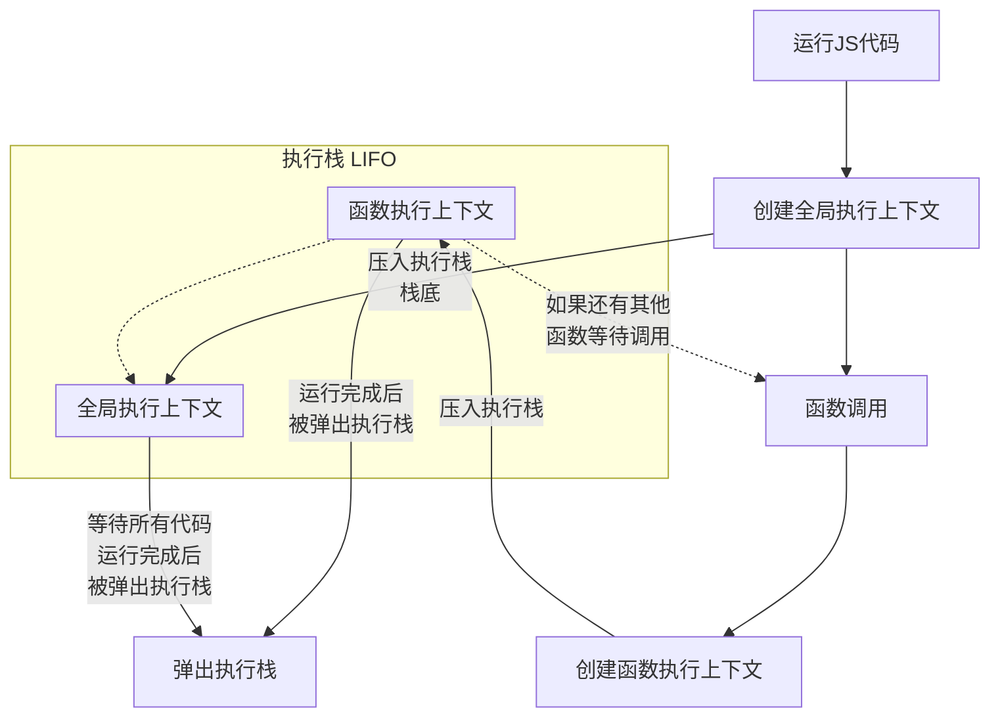

# 执行上下文与this

执行上下文是 Javascript 中一个十分重要的概念，当我们运行一段 JS 代码时，这段代码实际上就运行在执行上下文中，理解执行上下文的相关知识可以帮助我们更好的理解 JS 代码是如何运行的

## 什么是执行上下文
执行上下文是指在执行 JS 代码时，JS 解释器需要的所有信息。它包括变量、函数声明、作用域和 **this** 关键字的值，可以理解为执行上下文是在执行 JS 代码前做好了一切准备工作，确保 JS 代码可以顺利执行

## 执行上下文的分类
执行上下文可以分为全局执行上下文和函数执行上下文

- **全局执行上下文**：全局执行上下文是 JS 代码运行时的环境。它是为运行代码主体而创建的执行上下文，也就是说它是为那些存在于函数之外的任何代码而创建的。全局执行上下文只有一个，它在 JS 代码开始执行时创建，并在所有代码执行完毕后销毁。全局执行上下文包含了全局对象，以及一些全局变量和函数。当 JS 代码运行时，它实际上是运行在全局执行上下文中
- **函数执行上下文**：函数执行上下文是在函数被调用时创建的。当函数被调用时，JS 引擎会创建一个新的执行上下文，并将其压入**执行栈**中。在函数执行完毕后，该执行上下文会被弹出栈。每个函数都有自己的执行上下文，它包含了函数内部的变量、函数参数、函数声明等信息。函数执行上下文与全局执行上下文不同，它是为了执行特定的函数而创建的，而全局执行上下文是为运行代码主体而创建的

```js
var a = 1;
function foo(){
    console.log(a); 
}
foo(); // 1
```



<Minfo>

执行栈：也称为调用栈，是 JS 引擎用来跟踪函数调用的一种数据结构。它是一个先进后出（LIFO）的栈结构，用于存储执行上下文。当 JS 引擎执行代码时，它会创建一个全局执行上下文并将其压入执行栈中。每当一个函数被调用时，JS 引擎会创建一个新的执行上下文并将其压入执行栈的顶部。当函数返回时，该执行上下文会被弹出栈。这样，JS 引擎就能够跟踪函数调用的顺序，并在函数返回时恢复正确的执行上下文

</Minfo>

## 执行上下文的创建过程
