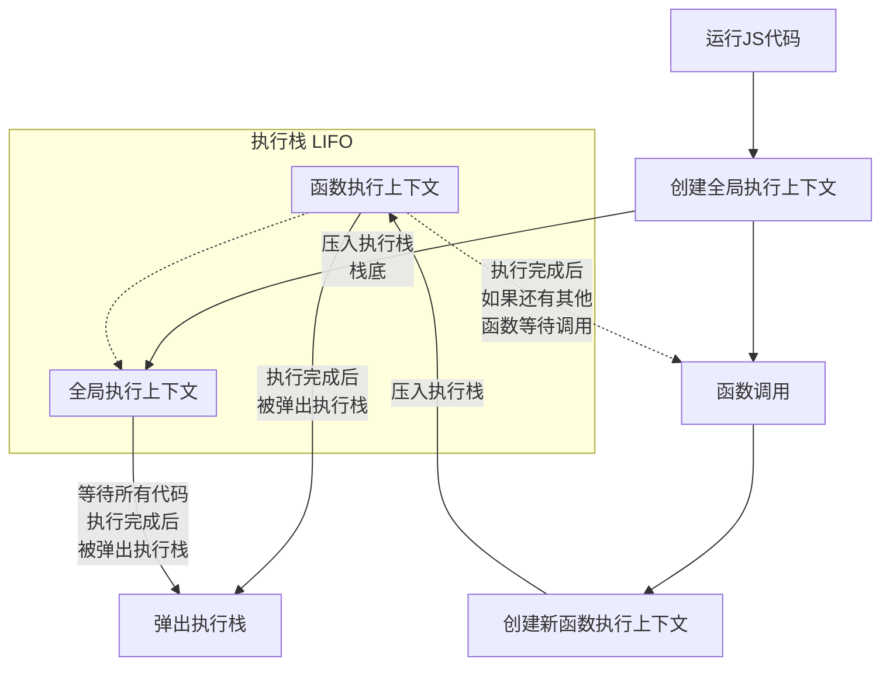

# 执行上下文

执行上下文是 Javascript 中一个十分重要的概念，当我们运行一段 JS 代码时，这段代码实际上就运行在执行上下文中，理解执行上下文的相关知识可以帮助我们更好的理解 JS 代码是如何运行的

## 什么是执行上下文
执行上下文是指在执行 JS 代码时，JS 解释器需要的所有信息。它包括变量、函数声明、作用域和 **this** 关键字的值，可以理解为执行上下文是在执行 JS 代码前做好了一切准备工作，确保 JS 代码可以顺利执行

## 执行上下文的分类
执行上下文可以分为 **全局执行上下文** 和 **函数执行上下文**

### 全局执行上下文
**全局执行上下文** 是 JS 代码运行时的环境。它是为运行代码主体而创建的执行上下文，也就是说它是为那些存在于函数之外的任何代码而创建的。全局执行上下文只有一个，它在 JS 代码开始执行时创建，并在所有代码执行完毕后销毁。全局执行上下文包含了全局对象，以及一些全局变量和函数。当 JS 代码运行时，它实际上是运行在全局执行上下文中
### 函数执行上下文
**函数执行上下文**是在函数被调用时创建的。当函数被调用时，JS 引擎会创建一个新的执行上下文，并将其压入**执行栈**中。在函数执行完毕后，该执行上下文会被弹出栈。每个函数都有自己的执行上下文，它包含了函数内部的变量、函数参数、函数声明等信息。函数执行上下文与全局执行上下文不同，它是为了执行特定的函数而创建的，而全局执行上下文是为运行代码主体而创建的

<Minfo>

执行栈：也称为调用栈，是 JS 引擎用来跟踪函数调用的一种数据结构。它是一个先进后出（LIFO）的栈结构，用于存储执行上下文。当 JS 引擎执行代码时，它会创建一个全局执行上下文并将其压入执行栈中。每当一个函数被调用时，JS 引擎会创建一个新的执行上下文并将其压入执行栈的顶部。当函数返回时，该执行上下文会被弹出栈。这样，JS 引擎就能够跟踪函数调用的顺序，并在函数返回时恢复正确的执行上下文

</Minfo>

## 执行上下文的创建
创建执行上下文可以分为以下几步：
* 进行 **this** 绑定，确定 **this** 的指向
* 创建 **词法环境** 组件
* 创建 **变量环境** 组件

下面会对上述3个步骤进行简要分析

### this 绑定
在全局执行上下文中，**this** 指向全局对象（在浏览器中指向全局对象 `window`，在 nodeJs 中指向全局对象 `global`，在严格模式下则是 `undefined`）  

在函数执行上下文中，**this** 的指向则取决于函数是如何被调用的（可以理解为谁调用了这个函数，那么这个函数的 **this** 就指向了谁）

```js
var name = "Jhon";
function greet(){
   console.log(`Hello! ${this.name}`);
}
greet(); //(this指向全局对象window) Hello! Jhon

var person = {
    name:"Mike",
    action: function(){
       console.log(`Hi! ${this.name}`);
    }
}
person.action();  //(this指向变量对象person) Hi! Mike
```
上面代码的 this 指向的伪代码就像这样
```js
GlobalExectionContext = {        //全局执行上下文
  ThisBinding: window,           
  // LexicalEnvironment: {},     // 全局词法环境   
  // VariableEnvironment: {}     // 变量环境
}

FunctionExectionContext = {      //函数执行上下文
  ThisBinding: person,
  // LexicalEnvironment: {},    // 函数词法环境
  // VariableEnvironment: {}    // 变量环境
}
```
<Minfo>

**this** 的指向并非总是固定的，JS 中还提供了一些方法（`call`、`apply`、`bind` 等）使我们可以更改 this 的指向，从而满足开发的需要

</Minfo>

### 词法环境
**词法环境**（Lexical Environment）是由环境记录器和外部环境引用两个内部组件组成的
* 环境记录器（EnvironmentRecord）：定义的变量与函数都存储在这里
* 外部环境引用（outer）：可以访问外部的词法环境
      
词法环境是一个抽象的概念，用于描述当前代码的运行环境。它是一个包含了标识符绑定（Identifier Bindings）的映射结构，这些绑定由变量、函数声明、函数形参和 catch 语句的异常对象组成。词法环境有两种类型：**全局环境** 和 **函数环境**
    
#### 全局环境
全局环境属于词法环境之一，它的外部词法环境引用为 null。this 指向为全局对象（global object）。拥有由用户定义的全局变量以及一些内置对象，例如 `Math`、`String` 和 `Array` 等
#### 函数环境
函数环境也属于词法环境之一，它的外部词法环境引用为可能是全局环境或者包含了这个函数的外部函数环境。this 指向取决于函数是如何调用的。拥有在函数内部定义的变量，一个 `arguments` 参数对象（包含了调用该函数时传入的实参）和参数的长度 `length`

```js
let a = 1;
function add3(num){
   const b = 3;
   return a + b;
}
console.log(add3(a)); // 4
```
上面代码的词法环境创建的伪代码就像这样：

```js
GlobalExectionContext = {     //全局执行上下文
  // ThisBinding: <Global Object>,           
  LexicalEnvironment: {       // 全局词法环境
    EnvironmentRecord: {
      Type: "Object",
      // 在这里绑定标识符
      a: < uninitialized >,   // let、const声明的变量
      add3: < func >          // 函数声明
    }
    outer: <null>             // 全局环境对外部环境的引用为 null           
  },
  // VariableEnvironment: {}     // 变量环境
}

FunctionExectionContext = {    //函数执行上下文
  // ThisBinding: <Global Object>,
  LexicalEnvironment: {               // 函数词法环境
    EnvironmentRecord: {   
      Type: "Declarative",
      // 在这里绑定标识符
      b: < uninitialized >,           // let、const声明的变量
      Arguments: {0: 1, length: 1},   // arguments对象
    },
    outer: <GlobalLexicalEnvironment>  //外部引用为全局词法环境
  },
  // VariableEnvironment: {}    // 变量环境
}
```
### 变量环境
变量环境与词法环境类似，但它只包含了由 `var` 声明的变量

```js
var str = "abc"
function a(){
   var name = "Alice"
}
```
上面的变量环境的创建的伪代码就像这样：

```js
GlobalExectionContext = {        //全局执行上下文
  //ThisBinding: <Global Object>,           
  // LexicalEnvironment: {},     // 全局词法环境   
  VariableEnvironment: {         // 变量环境
    EnvironmentRecord: {
      Type: "Object",
      //存储并直接定义 var 变量
      str: undefined,
    }
    outer: <null>
  }     
}

FunctionExectionContext = {      //函数执行上下文
  //ThisBinding: <Global Object>,
  // LexicalEnvironment: {},    // 函数词法环境
  VariableEnvironment: {        // 变量环境
     EnvironmentRecord: {
      Type: "Object",
      //存储并直接定义 var 变量
      name: undefined,
    }
    outer: <null>
  }    
}
```

由上代码可以看出， `var` 定义的变量存储于执行上下文的变量环境中，并且直接将其初始化为 `undefined`，从这里也可以解释开发中遇到的变量提升的现象，而 `let`、`const` 所定义的变量则是存储于词法环境中，并没有被初始化，所以就不能在定义之前使用，不存在变量提升。在词法环境中还包含了对外部环境的引用，如果这个被引用的外部环境中又引用了其他的外部环境，就像一条锁链一样对外部环境的引用一直延伸下去，就形成了一条链式引用的结构，这就是我们常说的作用域链。甚至闭包的产生也与此相关

## 简要图示

