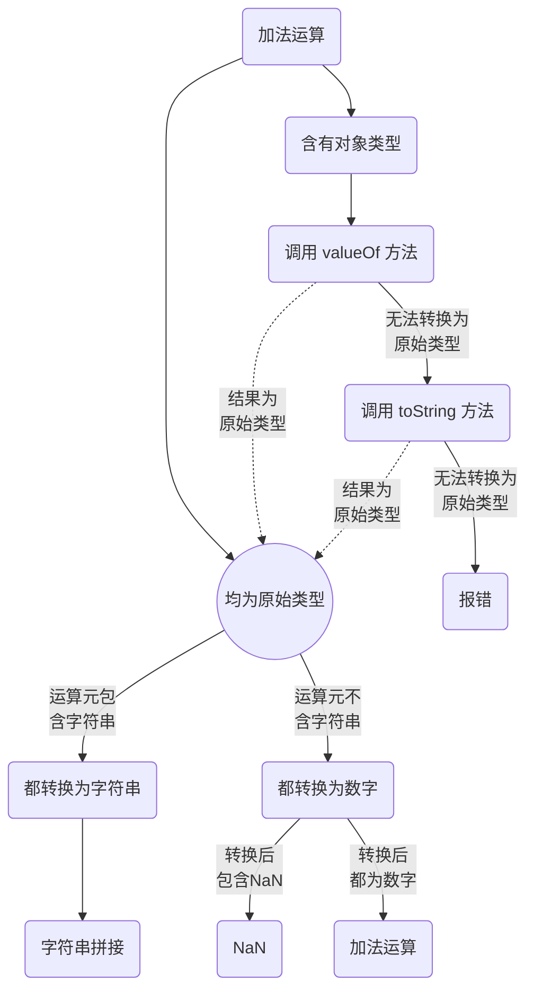

# 运算规则

在了解了 JS 中的变量和运算符后，还应当知道这些运算符是如何对不同的变量进行计算求值的，它们之间有又着怎样的计算规则？理解清楚这其中的规则将会对开发工作十分有用

## 运算元与运算符
在了解运算规则之前要首先了解一些基本的运算概念

### 运算元
**运算元**是指运算符应用的对象。例如：`1 + 2`，有两个运算元：左运算元 `1` 和右运算元 `2`。这两个运算元也可称为运算参数

```js
console.log(1 + 2); // 3
```

### 一元运算符
当运算符对应的运算元只有一个时，那么这个运算符就是 **一元运算符**，例如代表数字正负的 `+`、`-` 一元运算符

```js
let x = +1;
console.log(x); // 1

let y = -2;
console.log(y); // -2
```
### 二元运算符
当一个运算符有两个运算元时，那么这个运算符就是 **二元运算符**，例如最常见的加法运算就使用了二元运算符 `+`、`-`、`*`、`/` 等

```js
let x = 3 + 2;
console.log(x); // 5

let y = 5 * 4;
console.log(y); // 20 
```

## 运算符的优先级
当一个表达式只有一个运算符时，就会按照基本的运算法则执行运算，当表达式中有多个运算符时，就要按照运算符的 **优先级** 来执行计算了

### 优先级列表
在包含有多个运算符的表达式中，运算符的优先级越高，那么就越优先执行这个运算符及所对应的运算元的计算，下面的表格展示了各运算符对应的优先级（数字越大则优先级越高）

| 优先级 | 运算符类型                  | 运算顺序 | 运算符              |
| ------ | --------------------------- | -------- | ------------------- |
| 19     | 分组                        | /        | `( xxx... )`           |
| 18     | 成员访问                    | 从左到右 | `x.x`               |
| 18     | 需计算的成员访问            | 从左到右 | `xxx[x]`            |
| 18     | new（带参数列表）           | /        | `new( xxx )`        |
| 18     | 函数调用                    | 从左到右 | `xxx()`             |
| 18     | 可选链（Optional chaining） | 从左到右 | `?.`                |
| 17     | new（无参数列表）           | 从右到左 | `new`               |
| 16     | 后置递增                    | /        | `++`                |
| 16     | 后置递减                    | /        | `--`                |
| 15     | 逻辑非 (!)                  | 从右到左 | `!`                 |
| 15     | 按位非 (~)                  | 从右到左 | `~`                 |
| 15     | 一元加法 (+)                | 从右到左 | `+`                 |
| 15     | 一元减法 (-)                | 从右到左 | `-`                 |
| 15     | 前置递增                    | 从右到左 | `++`                |
| 15     | 前置递减                    | 从右到左 | `--`                |
| 15     | typeof                      | 从右到左 | `typeof`            |
| 15     | void                        | 从右到左 | `void`              |
| 15     | delete                      | 从右到左 | `delete`            |
| 15     | await                       | 从右到左 | `await`             |
| 14     | 幂 (**)                     | 从右到左 | `**`                |
| 13     | 乘法 (*)                    | 从左到右 | `*`                 |
| 13     | 除法 (/)                    | 从左到右 | `/`                 |
| 13     | 取余 (%)                    | 从左到右 | `%`                 |
| 12     | 加法 (+)                    | 从左到右 | `+`                 |
| 12     | 减法 (-)                    | 从左到右 | `-`                 |
| 11     | 按位左移 (<<)               | 从左到右 | `<<`                |
| 11     | 按位右移 (>>)               | 从左到右 | `>>`                |
| 11     | 无符号右移 (>>>)            | 从左到右 | `>>>`               |
| 10     | 小于 (<)                    | 从左到右 | `<`                 |
| 10     | 小于等于 (<=)               | 从左到右 | `<=`                |
| 10     | 大于 (>)                    | 从左到右 | `>`                 |
| 10     | 大于等于 (>=)               | 从左到右 | `>=`                |
| 10     | in                          | 从左到右 | `in`                |
| 10     | instanceof                  | 从左到右 | `instanceof`        |
| 9      | 相等 (==)                   | 从左到右 | `==`                |
| 9      | 不相等 (!=)                 | 从左到右 | `!=`                |
| 9      | 一致/严格相等 (===)         | 从左到右 | `===`               |
| 9      | 不一致/严格不相等 (!==)     | 从左到右 | `!==`               |
| 8      | 按位与 (&)                  | 从左到右 | `&`                 |
| 7      | 按位异或 (^)                | 从左到右 | `^`                 |
| 6      | 按位或 (\|)                 | 从左到右 | `\|`                |
| 5      | 逻辑与 (&&)                 | 从左到右 | `&&`                |
| 4      | 逻辑或 (\|\|)               | 从左到右 | `\|\|`              |
| 4      | 空值合并 (??)               | 从左到右 | `??`                |
| 3      | 条件（三元）运算符          | 从右到左 | ` xxx ? xxx : xxx ` |
| 2      | 赋值                        | 从右到左 | `=`                 |
| 2      | 赋值                        | 从右到左 | `+=`                |
| 2      | 赋值                        | 从右到左 | `-=`                |
| 2      | 赋值                        | 从右到左 | `**=`               |
| 2      | 赋值                        | 从右到左 | `*=`                |
| 2      | 赋值                        | 从右到左 | `/=`                |
| 2      | 赋值                        | 从右到左 | `%=`                |
| 2      | 赋值                        | 从右到左 | `<<=`               |
| 2      | 赋值                        | 从右到左 | `>>=`               |
| 2      | 赋值                        | 从右到左 | `>>>=`              |
| 2      | 赋值                        | 从右到左 | `&=`                |
| 2      | 赋值                        | 从右到左 | `^=`                |
| 2      | 赋值                        | 从右到左 | `\|=`               |
| 2      | 赋值                        | 从右到左 | `&&=`               |
| 2      | 赋值                        | 从右到左 | `\|\|=`             |
| 2      | 赋值                        | 从右到左 | `??=`               |
| 1      | 逗号 / 序列                 | 从左到右 | `,`                 |

<Minfo type=warning>

从上表可以看出分组运算符 `( )` 优先级最高，但是在某些情况下并不会优先计算，例如
```js
let a; //undefined
let b = a && (2 + 5);
console.log(b);  //undefined
```
上面的例子中并没有计算 `(2 + 5)`，而是直接返回了a（`undefined`），上面这种运算方式叫做短路运算（计算顺序从左往右），但当左运算元为假值时，就会直接返回，不再往后计算了。因此在遇到短路运算时应当注意
</Minfo>

<Minfo>

更多关于运算符优先级的信息请 [点击这里][operator]

</Minfo>

## 计算不同类型的数据
在开发中我们经常会遇到对不同类型的数据进行运算，特别是加法运算，在左右运算元都是数字的情况下我们可以很容易的得出计算结果，但是当左右运算元是不同类型的情况下，计算就开始变得复杂起来了，但是也会遵顼一定的计算规则
### 运算过程


理解图中的运算过程，将会极大的帮助我们解决开发过程中遇到的计算问题


<Minfo>

原始类型：JS 中的原始类型也叫基本类型，包括 `null`、`undefined`、`Boolean`、`Number`、`String`、`BigInt`、`Symbol`

</Minfo>


[operator]: https://developer.mozilla.org/zh-CN/docs/Web/JavaScript/Reference/Operators/Operator_Precedence