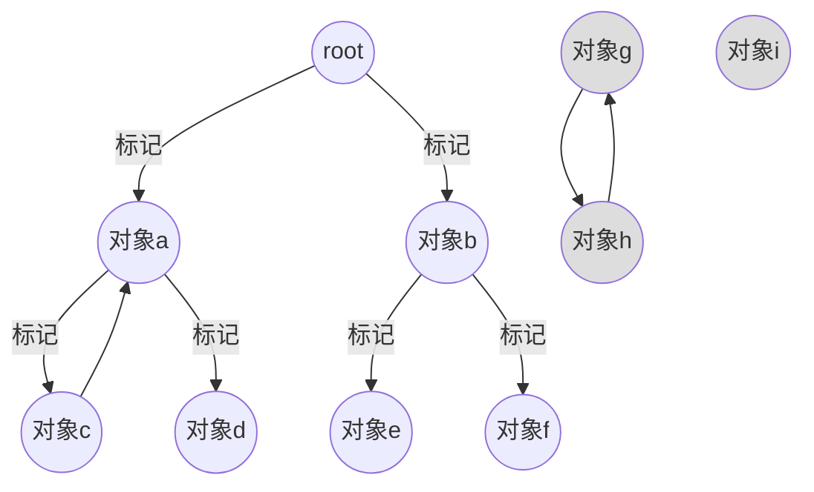

# 垃圾回收
在计算机程序中，无论是定义变量或方法，都需要内存将其存储下来，以便在需要时能够访问到它们，但是内存的大小始终是有限的，为了更加高效的利用有限的内存资源，当我们不再需要某个变量或方法时，就要将它们所占用的内存回收（释放），以便为其他的程序提供空间

但是在我们编写 JS 代码时，似乎并没有直接参与到内存管理的工作当中，这是因为 JS 有着自己的内存管理机制，这种内存管理机制是自动的、无形的
>
> 随风潜入夜，润物细无声
> 
就像诗句中描述的一样，在我们编写的程序工作时，JS 引擎已经默默的替我们完成了内存管理的工作

## 内存分配
当我们在 JS 中定义变量时，JS 引擎就已经替我们完成了内存分配的工作
```js
var a = 1;  
//定义了一个数字类型的变量（基本类型），存储在栈中

const obj = {
    name:"obj"  
}
//定义了一个对象（引用类型），将值存储在堆中，引用地址存储在栈中

function foo(){
    console.log("foo"); 
}  
//定义了一个函数（引用类型），将值存储在堆中，引用地址存储在栈中         
```
<Minfo>

关于变量在内存中的存储方式请看 [变量存储方式](/blog-js/09.md) 这一章节

</Minfo>

## 垃圾回收
通过前面章节的学习，我们知道，保存在栈中的变量在使用完后会由系统来自动释放其所占用的内存，而实际保存在堆中的对象却要通过某些机制来控制其内存的释放，垃圾回收算法便是针对那些已经“不在需要”的对象释放它们的内存的机制

垃圾回收算法主要依赖的是 **引用** 的概念，即一个对象如果有访问另一个对象的权限，那么就叫做一个对象对另一个对象的引用，而垃圾回收所作的工作便是找出那些没有被任何其他对象所引用的对象，将其占用的内存释放掉

释放对象所占内存主要有两种方法：
* 引用计数
* 标记清除

### 引用计数
引用计数算法会从根开始遍历，找出所有被引用的对象。当变量被声明并赋值引用了某个对象后，就将该对象的引用次数设置为1，当这个对象又被其他变量引用，就将这个对象的引用次数 `+1`，当引用该对象的变量的值被覆盖时，就将这个的对象的引用次数 `-1`，直到这个对象的引用次数为0时，就将它所占用的内存释放掉

```js
//在内存中创建对象{value:2}，将这个对象的引用地址赋值给变量a，此时对象a的引用计数为1
let a = {value:2}; 

// 在内存中创建对象{c:{value:2}}，将这个对象的引用地址赋值给变量b，b对象的属性c引用了对象a，
// 此时对象a的引用计数为2，对象b的引用计数为1，对象c的引用计数也为1
let b = {
    c:a   
}；

//将变量a的值用字符串1（原始值）覆盖，对象{value:2}的引用计数减一,变成了1
let a = "1"; 

//将变量b的值用null覆盖，对象{c:{value:2}}的引用计数减一,变成了0，可以被垃圾回收了
//对象{value:2}由于对象{c:{value:2}}已经是0引用，所以{value：2}也是0引用
//对象{value:2}也会被垃圾回收
let b = null; 
```
通过上面的例子可以看出，引用计数算法通过获取引用次数为0的对象来进行垃圾回收从而释放掉它们所占用的内存，但是这样的方法也会存在缺陷，那就是无法处理 **循环引用** 的对象

```js
function foo(){
    let foo = {};
    let bar = {};
    foo.o = bar; //对象foo的属性o引用了对象bar
    bar.o = foo; //对象bar的属性o引用了对象foo，此时形成了循环引用，无法被垃圾回收

    return "foo";
}

foo();
```
**循环引用** 的对象在不需要时应当被显式删除（`delete` 删除）或者将值设置为 `null`，否则引用计数算法会判断循环引用的两个对象都至少有一次引用次数，无法释放它们所占用的内存

### 标记清除
标记清除算法不在关注对象是否是 `0` 引用，取而代之的是判断对象是否 **可达**（即对象是否能够通过某种方式访问到），这种方式能够很好的避免循环引用的问题，目前大部分浏览器垃圾回收机制应用的都是标记清除算法
   
#### 对象的可达性  
对象的可达性是指可以通过某种方式访问到该对象，如果一个对象（值）可以通过作用域链从根对象被访问到，那么可以认为这个对象（值）是 **可达** 的。通常垃圾回收会从根对象开始遍历，找到那些不可达的（即无法访问的）对象，将它们的内存释放掉

<Minfo>

根对象包括：
* 当前执行的函数，它的局部变量和参数（当前函数执行上下文对象）
* 当前嵌套调用链上的其他函数、它们的局部变量和参数（被当前上下文词法环境引用的外部环境/外部上下文对象）
* 全局变量
* 一些内置对象

</Minfo>

#### 执行过程
标记清除算法的执行过程可以分为以下两个阶段：
1. **标记阶段**：
  垃圾回收机制会从根对象（一般是全局对象 `window`）开始，周期性的对内存中的所有对象进行遍历，将遍历过程中可达的对象打上标记（打上标记意味着是活跃对象，不是垃圾），不可达的对象没有标记（即非活跃对象，会被当成垃圾回收），直到找到所有可达的对象
2. **清除阶段**：
  在标记阶段没有标记的对象被认为是不可达的（即无法访问），会被删除以释放内存

这些步骤会在后台定期自动执行，不需要人为干预  




```js
var div;
window.onload  = function(){
    div = document.getElementById("div");   //将变量div赋值为一个dom对象
    div.someAttr = div;    //div对象中的某个属性引用了它自身，造成了循环引用
    div.someData = new Array(10000).join("*"); //div对象中还保存了大量数据
}

function foo(){
    let foo = {};
    let bar = {};
    foo.o = bar; //对象foo的属性o引用了对象bar
    bar.o = foo; //对象bar的属性o引用了对象foo，造成了循环引用

    return "foo";
}
```  
在以上的两个例子中，垃圾回收机制都会从根对象（函数执行上下文对象）开始遍历，无论是 `div` 还是 `foo`、`bar` 对象，它们在方法执行时是可达的，可以保留在内存中，但是当方法执行完成后，由于函数执行上下文会出栈，无法通过函数的返回值或其他方式访问到函数内部的变量（对象），那么这些定义在函数内部的变量（对象）就会被认为是不可达的，即使它们存在循环引用，照样会被当成垃圾回收掉从而释放内存

但是标记清除算法也并非完美，它同样存在着一些缺陷：在代码中垃圾的产生是千变万化的，它们在内存中的存储位置可能是不连续的，这样就会导致垃圾回收后产生许多碎片化的内存空间，降低了内存空间的利用率

## 改进方法
浏览器中现有的垃圾回收方法都是基于 **标记清除** 算法进行改进后得来的，其中 chrome 的 V8 引擎使用的垃圾回收机制就是基于标记清除法改进的 **分代回收** 法

### 分代回收
为了提高垃圾回收的效率与性能，V8 引擎在标记清除法的基础上进行了改进-使用了分代回收法，分代回收法根据对象在内存中存在的周期将对象分为两类：
* **新生代**：
   存放的是存在周期较短的对象（经历过一次垃圾回收后就被释放掉内存），新生代中将内存分为两部分空间，一部分用来存放新产生的对象（From），另一部分是空闲空间（To），在将来会与存有对象的空间进行交换并整理排序
* **老生代**：
   存放的是存在周期比较长的对象（经历过多次垃圾回收后任然存在内存中的对象），当新生代内存中的对象存在达到某个阈值后，就会触发晋升机制，将其转移到老生代内存中存储


V8 引擎中的副垃圾回收器和主垃圾回收器通过使用改进的标记清除算法，分别负责回收新生代与老生代内存中的垃圾从而释放内存，提高了垃圾回收的效率


<Minfo>

更多与垃圾回收的信息请点击 [JS 垃圾回收]

</Minfo>

[JS 垃圾回收]:https://juejin.cn/post/7274146202496090170