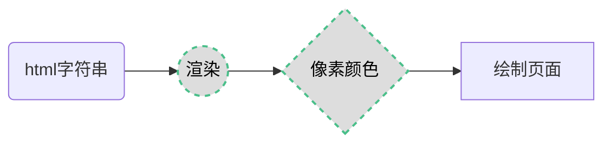
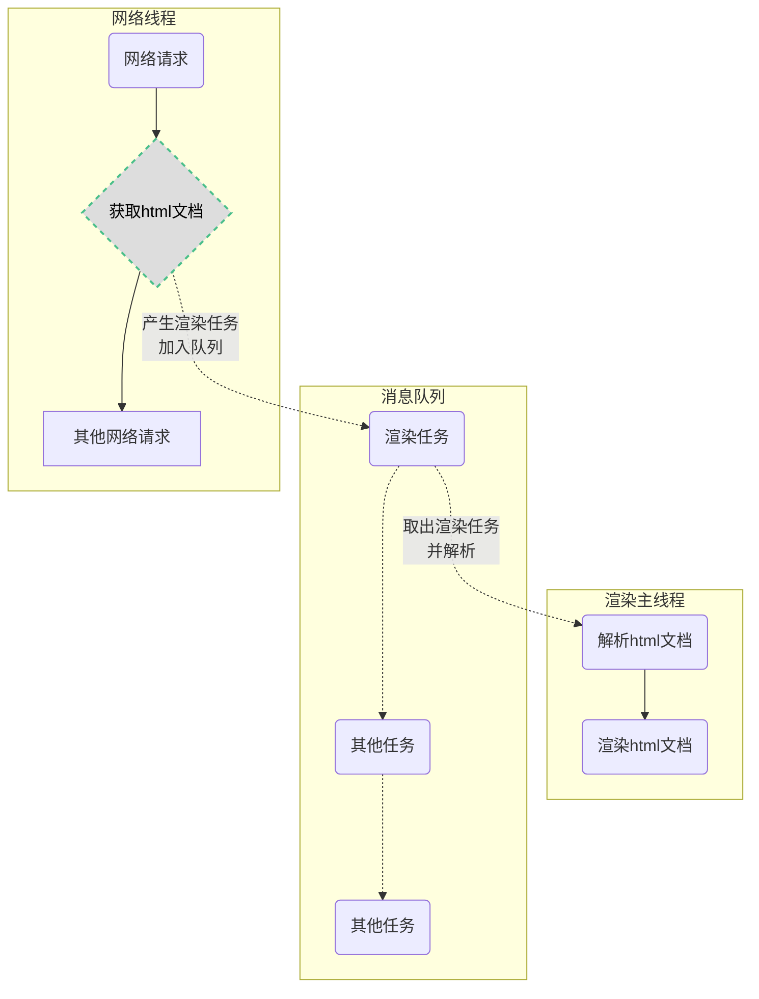
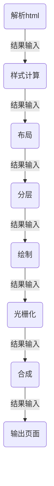

# 浏览器渲染原理

我们会在编辑器里写出各种各样的 `HTML`、`CSS`、`JavaScript` 代码，但是当这些代码运行在浏览器中时，就会变成多姿多彩的页面呈现给用户，那么浏览器是如何将代码转变成页面的呢，接下来将会对此过程进行简略研究

## 什么是渲染
**渲染**（render）在不同的场景下有不同的含义，但是在浏览器中，渲染是指将一段 `html` 字符串变成屏幕上的像素信息的过程

当我们在浏览器的地址栏输入一个 `url` 后，就会得到一个对应的页面，这看起来似乎是理所当然的，但是浏览器却在背后做了许多精细且复杂的计算：将 `html` 字符串经过各种计算后得到屏幕上每个像素点的颜色信息，然后再将这些颜色信息的数据传递给 GPU 绘制成屏幕上的一帧（`frame`）画面，这就是我们看到的页面（当我们滑动滚动条或进行其他交互操作时，页面的内容就会发生变化，浏览器就会重新计算屏幕上每个像素点的颜色，然后再渲染出来）

```js
// 渲染的伪代码
function render(html){ 
    //...一些复杂的计算逻辑
    //经过计算得到了每个像素点的颜色信息
    //第一行：[rgb(xxx),rgb(xxx),rgb(xxx), ......]
    //第二行：[rgb(xxx),rgb(xxx),rgb(xxx), ......]
    //第三行：[rgb(xxx),rgb(xxx),rgb(xxx), ......]
    //.....
    return pixels;
}
```



## 进程与线程
在了解浏览器的渲染过程之前，需要先了解 进程 与 线程 的基本概念，实际上浏览器的渲染工作都是在浏览器中的各个进程与线程互相协调配合下，共同完成的

* **进程** 是系统中正在运行的一个程序，程序一旦运行就是进程。进程可以看成程序执行的一个实例，是系统资源分配的独立实体，每个进程都拥有独立的地址空间。一个进程无法直接访问另一个进程的变量和数据结构，如果想让一个进程访问另一个进程的资源，需要使用进程间通信。一个进程可以拥有多个线程，每个线程使用其所属进程的栈空间    
我们可以将进程简单的理解为程序运行的一块内存空间（即程序工作的地方）

* **线程** 是进程的一个实体，是进程的一条执行路径，一个进程至少要有一个线程（主线程），也可能会存在多个线程（主线程和其他线程），当一个线程修改了进程的资源，它的兄弟线程可以立即看到这种变化，如果主线程结束了，那么整个进程就会随之结束
     
我们可以将线程简单理解为进程中实际执行各种任务的执行者（即实际“干活的人”）     


## 如何渲染
浏览器是如何将得到的 `html` 字符串渲染成屏幕上五光十色的页面的呢，实际上当用户在访问某个页面时，浏览器主要的任务大致可以分为两个阶段：
1. **网络通信**：获取页面 `html` 字符串以及其他跟页面相关的数据
2. **渲染页面**：将获取到的 `html` 字符串以及其他相关数据解析并绘制成最终的页面  
       
在浏览器中，这两个阶段都有与之对应的线程来负责完成各项任务，接下来会尽可能的详细解释浏览器的渲染过程     



### 渲染过程
当浏览器的网络线程接收到 `html` 文档后，会产生一个渲染任务，将获得的 `html` 文档传递给渲染主线程并存入消息队列中，然后在事件循环机制的作用下，渲染主线程会取出这个渲染任务，开启渲染流程，整个渲染流程可以分为以下几步：**解析html**、**样式计算**、**布局**、**分层**、**绘制**、**光栅化**、**合成**、**输出最终页面**



在上面的渲染过程中，每一步都是紧密相关的，上一步骤的输出会传递给下一步骤作为输入

### 解析html
