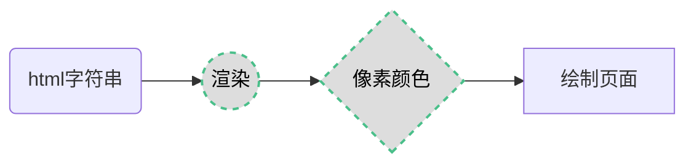
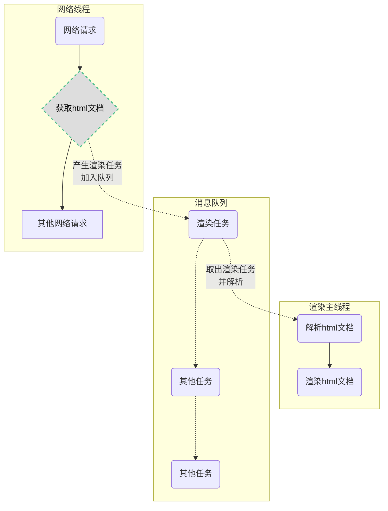
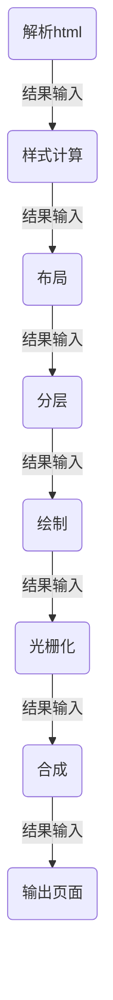

# 浏览器渲染原理

我们会在编辑器里写出各种各样的 `HTML`、`CSS`、`JavaScript` 代码，但是当这些代码运行在浏览器中时，就会变成多姿多彩的页面呈现给用户，那么浏览器是如何将代码转变成页面的呢，接下来将会对此过程进行简略研究

## 什么是渲染
**渲染**（render）在不同的场景下有不同的含义，但是在浏览器中，渲染是指将一段 `html` 字符串变成屏幕上的像素信息的过程

当我们在浏览器的地址栏输入一个 `url` 后，就会得到一个对应的页面，这看起来似乎是理所当然的，但是浏览器却在背后做了许多精细且复杂的计算：将 `html` 字符串经过各种计算后得到屏幕上每个像素点的颜色信息，然后再将这些颜色信息的数据传递给 GPU 绘制成屏幕上的一帧（`frame`）画面，这就是我们看到的页面（当我们滑动滚动条或进行其他交互操作时，页面的内容就会发生变化，浏览器就会重新计算屏幕上每个像素点的颜色，然后再渲染出来）

```js
// 渲染的伪代码
function render(html){ 
    //...一些复杂的计算逻辑
    //经过计算得到了每个像素点的颜色信息
    //第一行：[rgb(xxx),rgb(xxx),rgb(xxx), ......]
    //第二行：[rgb(xxx),rgb(xxx),rgb(xxx), ......]
    //第三行：[rgb(xxx),rgb(xxx),rgb(xxx), ......]
    //.....
    return pixels;
}
```



## 进程与线程
在了解浏览器的渲染过程之前，需要先了解 进程 与 线程 的基本概念，实际上浏览器的渲染工作都是在浏览器中的各个进程与线程互相协调配合下，共同完成的

* **进程** 是系统中正在运行的一个程序，程序一旦运行就是进程。进程可以看成程序执行的一个实例，是系统资源分配的独立实体，每个进程都拥有独立的地址空间。一个进程无法直接访问另一个进程的变量和数据结构，如果想让一个进程访问另一个进程的资源，需要使用进程间通信。一个进程可以拥有多个线程，每个线程使用其所属进程的栈空间    
我们可以将进程简单的理解为程序运行的一块内存空间（即程序工作的地方）

* **线程** 是进程的一个实体，是进程的一条执行路径，一个进程至少要有一个线程（主线程），也可能会存在多个线程（主线程和其他线程），当一个线程修改了进程的资源，它的兄弟线程可以立即看到这种变化，如果主线程结束了，那么整个进程就会随之结束
     
我们可以将线程简单理解为进程中实际执行各种任务的执行者（即实际“干活的人”）     


## 如何渲染
浏览器是如何将得到的 `html` 字符串渲染成屏幕上五光十色的页面的呢，实际上当用户在访问某个页面时，浏览器主要的任务大致可以分为两个阶段：
1. **网络通信**：获取页面 `html` 字符串以及其他跟页面相关的数据
2. **渲染页面**：将获取到的 `html` 字符串以及其他相关数据解析并绘制成最终的页面  
       
在浏览器中，这两个阶段都有与之对应的线程来负责完成各项任务，接下来会尽可能的详细解释浏览器的渲染过程     



### 渲染过程
当浏览器的网络线程接收到 `html` 文档后，会产生一个渲染任务，将获得的 `html` 文档传递给渲染主线程并存入消息队列中，然后在事件循环机制的作用下，渲染主线程会取出这个渲染任务，开启渲染流程，整个渲染流程可以分为以下几步：**解析html**、**样式计算**、**布局**、**分层**、**绘制**、**光栅化**、**合成**、**输出最终页面**



在上面的渲染过程中，每一步都是紧密相关的，上一步骤的输出会传递给下一步骤作为输入

### 解析html
浏览器会将接收到的 `html` 文档（一大段字符串）进行解析，解析的结果会生成一个 `DOM` 树（Document Object Model——文档对象模型）和一个 `CSSOM` 树（CSS Object Model——CSS 对象模型）
    
1. `DOM` 树会包含页面中的所有元素以及元素的属性，`DOM` 树上的每一个节点都是一个对象，代表了页面上的某个元素  
    
2. `CSSOM` 树会包含页面中的所有样式信息，`CSSOM` 树是由 css 规则组成的树形结构的，`CSSOM` 树上的每一个节点都是一个对象，用于描述对应的 `DOM` 元素的样式
    
主线程在解析 `html` 文档时，可能会遇到一些外部的样式资源，这时浏览器会开启一个单独的线程（预解析），用于加载解析这些外部样式资源，解析完成后再将结果传递给主线程，主线程对接收到的新样式信息进行处理，并更新 `DOM` 树和 `CSSOM` 树，所以主线程并不会因为解析 `css`  样式资源而阻塞    
  
同时主线程在解析文档的过程中还可能会遇到一些JS代码，此时主线程就要暂时停止对 `html` 文档的解析，转而去执行这些JS代码，因为这些JS代码中可能会有对当前生成的`DOM`树的操作，因此必须等待JS代码执行完成后再继续解析文档，所以主线程会因为JS代码的执行而产生阻塞

### 样式计算
在上一步中主线程解析出了 `DOM` 树和 `CSSOM` 树后，就会开启样式计算的步骤，主线程会遍历 `DOM` 树，然后根据 `CSSOM` 树来计算出每个节点最终的样式，并将这些计算好的样式信息保存在DOM节点的 `style` 属性中，最终形成一个包含所有节点信息和节点计算后的样式信息的 `Render` 树（渲染树）对象    
这个计算过程大致如下：
1. 确定声明值：将无冲突的样式的声明值作为 `css` 属性值
2. 进行**层叠冲突**：对有冲突的样式进行层叠计算，得到唯一属性值
3. 继承或设置默认值：对进行了前面两步后仍然没有属性值的样式，对其进行判断，若能继承父属性，则直接继承，若不能继承副属性，则直接使用默认值
4. 确定最终值

<Minfo>

层叠冲突是用来得到样式的属性值的最终结果的，它的大致过程如下:
1. 找出所有相关规则：这些规则包括给定元素匹配的选择器。

2. 按显示权重对所有样式声明排序：这个过程也被称为优先级排序。

3. 按照特殊性对所有样式声明排序：特殊性是指选择器的具体程度，例如，ID选择器的特殊性高于类选择器，类选择器的特殊性高于元素选择器。

4. 按照顺序对所有样式声明排序：如果优先级和特殊性都相同，那么后出现的规则会覆盖先出现的规则。
   
</Minfo>

### 布局
当主线程生成 `Render` 树后，就会开启布局的步骤，在这个步骤中会确定每个元素在页面上的位置和大小    
主线程会遍历带有最终样式信息的 `Render` 树，生成 `Layout` 树（布局树），`Layout` 树是一个只包含可见元素的树，它通过从渲染树中剔除不可见的元素（如`head`标签或使用了 `display:none` 属性的元素,这些元素不会被添加到 `Layout` 树中）来生成的  
   
在有了 `Layout` 树后，主线程就会计算 `Layout` 树中每个节点在页面上的位置，这个过程叫做 **布局** 或者 **重排**  

在布局完成之后，主线程就准备将这些节点绘制到屏幕上了，这个过程叫做 **绘制** 或者 **重绘**

<Minfo>

`DOM` 树和 `Layout` 树并不是相同的，`Layout` 树只包含可见元素，而 `DOM` 树包含所有元素

**重排**：当渲染树的一部分必须更新并且节点的尺寸发生了变化，浏览器会使渲染树中受到影响的部分失效，并重新构造渲染树。这个过程被称为重排。以下是一些可能导致重排的操作：

1. 添加、删除可见的DOM元素
2. 元素的位置改变
3. 元素的尺寸改变（例如外边距、内边距、边框厚度、宽高等几何属性）
4. 页面渲染初始化
5. 浏览器窗口尺寸改变
    
**重绘**：重绘是在一个元素的外观被改变所触发的浏览器行为，浏览器会根据元素的新属性重新绘制，使元素呈现新的外观  

**重排必定会发生重绘，重绘不一定会引发重排**，重排和重绘都会对网页性能产生影响，但重排的影响更为严重，因为它需要重新计算布局信息，重新生成 `Render` 树
</Minfo>

### 分层
在布局的步骤完成后，出于对网页绘制性能的考虑，主线程会根据 `Layout` 树来创建一个 `Layer` 层（分层树），`Layer` 树会将需要单独绘制的元素放在一个独立的渲染层中，不会影响到其他元素。而有一些元素会覆盖在其他的元素上面，这些元素也会被 `Layer` 树放在一个新的层中。        
     
在 `Layer` 树中，每个独立的层都会被单独处理，因此，当某个元素发生改变时，只需要重绘这一层，其他层不会发生变化，极大的提升了绘制的效率


<Minfo>

有一些 `css` 属性可能会对分层的结果产生影响，这些属性有：
1. z-index：z-index属性可以设置元素的堆叠顺序。拥有更高堆叠顺序的元素总是会处于堆叠顺序较低的元素的前面。但是，z-index属性只能在定位元素上奏效（例如position:absolute）。

2. 定位属性：position属性（如relative、absolute、fixed或sticky）也会影响元素的分层。使用这些属性的元素会创建一个新的层叠上下文。

3. opacity：当元素的opacity值小于1时，会创建一个新的层叠上下文。

4. transform：使用transform属性的元素会创建一个新的层叠上下文。

5. filter：使用filter属性的元素会创建一个新的层叠上下文。

6. will-change：当will-change属性指定为一个会创建新层叠上下文的属性值时，会创建一个新的层叠上下文。
</Minfo>

### 绘制
在生成 `Layer` 树后，主线程会根据 `Layer` 树来生成一个绘制列表，绘制列表包含了在该层上绘制的所有元素的指令，浏览器会根据这些指令来绘制页面，这个过程就像我们使用 `canvas` 画布元素绘制一样。其本质是在页面上进行像素填充
   
在完成绘制后，主线程会将每个图层的绘制信息提交给合成线程，剩余的工作将由合成线程来完成，合成线程会将图层绘制区域进行分块，以提高绘制的效率
    
### 光栅化
光栅化是将之前分成的每一小块都变成位图，这些位图中包含将要在屏幕上绘制的每个像素点的颜色信息。光栅化是GPU加速的关键步骤之一，因为它可以将几何图形转换成可以在屏幕上显示的像素图像。通过将图块光栅化，可以将每个图块渲染成像素图像，并将这些图像组合成最终的网页图像。这样，浏览器就可以更快地呈现页面，并且可以更好地利用GPU加速来提高性能
### 合成
在这一步骤中，浏览器渲染主线程的工作基本完成，剩下的步骤会交给合成线程来执行，合成线程会处理绘制信息，并将每个图层的绘制信息转换为屏幕上的像素，最后将它们组合成最终的屏幕图像。这个过程被称为合成
    
在这个过程中，会对元素的旋转、缩放、平移等变形样式进行处理（`transform`），这也是利用 `transform` 制作各种动画效率非常高的本质原因，因为跟变形相关的计算是在合成线程中进行，不会占用主线程资源
### 页面
在经过上述一系列复杂的步骤后，最终就得到了页面上面每个像素点的颜色信息，浏览器会利用这些信息进行填充绘制，最终将一个完整的页面呈现给用户