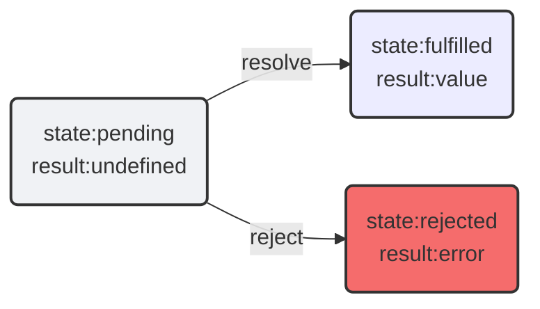

# Promise
JavaScript是一种单线程语言，这意味着它一次只能做一件事。然而，我们的应用程序经常需要处理多个任务，例如从服务器获取数据、处理用户输入或执行计算密集型任务。这就是我们需要异步编程的地方。在JavaScript中，Promise是处理异步操作的一种方法

## 什么是Promise
从现实生活的角度理解，Promise就像是一个容器（盒子），它里面存放一个“承诺”。这个“承诺”可以是任何东西，比如一个任务、一段数据或一个错误信息。当我们打开这个盒子时，就会知道这个“承诺”是什么以及这个“承诺”的“好坏”
     
从代码的角度理解，Promise是一个代表了其异步操作的最终完成（或失败）及其结果值的对象。一个Promise可能会处于以下状态之一：
    
- pending：初始状态，既不是成功，也不是失败状态
- fulfilled：意味着操作成功完成
- rejected：意味着操作失败     
      
Promise状态一旦改变，就会固定为该状态，不会再变



<Minfo>

当Promise被兑现后，即该Promise已经从 pending 状态改变为 fullfilled 或者rejected 时，此时Promise就是 settled （已敲定）状态。
</Minfo>

## Promise的基本用法 
Promise对象是一个构造函数，用来生成Promise实例

### 创建Promise实例
Promise构造函数接受一个回调函数作为它的参数，该回调函数的两个参数分别是 `resolve` 和 `reject`。它们同样是两个函数，由JS引擎内置：

- `resolve`: 当异步操作成功时调用，并将异步操作的结果作为参数传递出去
- `reject`: 当异步操作失败时调用，并将异步操作报出的错误作为参数传递出去
  
```js
const promise = new Promise((resolve, reject) => {
    // 异步操作
    if (/* 操作成功 */){
        resolve('成功的结果');
    } else {
        reject('失败的原因');
    }
});
```
<Minfo>

- Promise的 `state` 与 `result` 是内部状态：    
    Promise 对象的 state 和 result 属性都是内部的。我们无法直接访问它们。但我们可以对它们使用 .then/.catch/.finally 方法
- 一个Promise只能传递一个结果：   
    在Promise的回调函数内部，当异步操作完成后，只能调用 `resolve` 或 `reject` 其中的一个传递结果，不能同时调用，如果同时调用，则以第一次调用的为准，其他的会被忽略

</Minfo>

### 获取Promise的结果
Promise实例生成以后，可以用 `.then` 方法来获取它的结果，`then` 方法接受两个回调函数作为参数：第一个回调函数是 `resolve` 时的回调函数，第二个回调函数是 `reject` 时的回调函数

`.then` 方法是Promise中最基础最重要的方法
```js
const promise = new Promise((resolve, reject) => {
    // 异步操作
    if (/* 操作成功 */){
        resolve('成功的结果');
    } else {
        reject('失败的原因');
    }
});

const successHandler = result => console.log(result);
const errorHandler = error => console.error(error);

promise.then(successHandler, errorHandler);

```
当Promise中的异步操作成功时，调用 `resolve` 方法，并将结果作为参数传递给 `successHandler` 函数；当Promise中的异步操作失败时，调用 `reject` 方法，并将错误信息作为参数传递给 `errorHandler` 函数
   
通常情况下我们只对成功的结果感兴趣，所以 `.then` 方法只接收一个成功的回调函数，而失败的结果可以通过 `.catch` 方法来处理 
   
`.catch` 方法可以捕获Promise对象中 `reject` 方法抛出的错误信息，并调用相应的错误处理函数
```js
promise
    .then(successHandler)
    .catch(errorHandler);
```
Promise还有一个 `.finally` 方法，它不管Promise对象最后的状态如何都会执行，并且将结果作为参数传递给 `.finally` 方法  

`.finally` 方法的作用是设置一个处理程序在前面的操作完成后，执行清理/终结工作，无论前面的操作是成功还是失败
```js

const finallyHandler = () => console.log('Promise操作完成');

promise
    .then(successHandler)
    .catch(errorHandler)
    .finally(finallyHandler);
```
`.finally` 方法与 `.then` 方法的区别在于：`.finally` 方法的回调函数没有参数，而 `.then` 方法的回调函数可以接收Promise对象的结果作为参数，并且 `.finally` 方法会将Promise对象的成功结果或失败结果传递给下一个合适的处理程序


## Promise的链式调用
在上面介绍获取Promise对象的结果时，我们已经接触到了Promise链式调用的方法，下面我们来详细介绍一下Promise的链式调用
```js
const promise = new Promise((resolve, reject) => {
   setTimeout(() => resolve(1),1000)  
});

promise
    .then(result => {
        // resolve的结果
        console.log(result);  //1
        return result * 2;
    }).then(result =>{
        console.log(result);  //2
        return result + 3;    
    }).then(result =>{
        console.log(result);  //5
        return result - 1;
    }).then(result =>{
        console.log(result);  //4
    }).catch(error => {
        console.error(error);
    });
```
在上面的例子中，`.then` 方法一个接着一个的调用，不断的将处理结果传递给下一个处理程序，就像一条锁链一样，这就是Promise的链式调用   
    
Promise之所以能够进行链式调用，是因为Promise的 `.then` 方法或 `.catch` 方法会返回一个新的Promise对象，因此可以继续调用新的Promise对象的 `.then` 方法或 `.catch` 方法，实现链式调用

## Promise的静态方法
在Promise对象上，有 6 种静态方法，为我们执行异步操作提供了极大的便利

### Promise.resolve()
`Promise.resolve(value)` 方法可以直接使用 `value` 来创建一个 resolved 的 Promise 对象
```js
const promise = Promise.resolve(1);
//等价于
const promise = new Promise(resolve => resolve(1));
//promise的状态为 fulfilled
console.log(promise);  //Promise {<fulfilled>: 1}
```
### Promise.reject()
`Promise.reject(error)` 方法可以直接使用 `error` 来创建一个 rejected 的 Promise 对象
```js
const promise = Promise.reject(1);
//等价于
const promise = new Promise((resolve, reject) => reject(1));
//promise的状态为 rejected
console.log(promise);  //Promise {<rejected>: 1}
```

### Promise.all()
`Promise.all(iterable)` 方法的参数是一个可迭代的对象（通常接受一个由Promise对象组成的数组），返回一个新的Promise对象。只有当数组中所有Promise对象都 resolved 后，新的Promise对象才会 resolved，此时新Promise对象的结果就是参数数组中所有Promise对象的结果组成的数组
```js
const promise1 = new Promise((resolve, reject) => {
    resolve('1');
});
const promise2 = new Promise((resolve, reject) => { 
    resolve('2');
});
const promise3 = new Promise((resolve, reject) => {
    resolve('3');
});

const promise = Promise.all([promise1, promise2, promise3]);
promise.then(result=>console.log(result)) // [1,2,3]

```
`Promise.all()` 方法也可以接受一个由“常规”值组成的数组，这些“常规”值会依照原样被当作结果传递出去
```js
const promise = Promise.all([
    '1',
    new Promise(resolve => setTimeout(()=>resolve("2"),1000)),
    3
]);
promise.then(result=>console.log(result)) // ['1','2',3]
```

`Promise.all()` 方法传递的结果的顺序与参数数组中的Promise对象的顺序一致，即使前面的Promise对象花费了较长时间才 resolved

```js
const promise = Promise.all([
    new Promise(resolve => setTimeout(()=>resolve(1), 3000)),
    new Promise(resolve => setTimeout(()=>resolve(2), 2000)),
    new Promise(resolve => setTimeout(()=>resolve(3), 1000)),
]).then(result => console.log(result));  // [1, 2, 3]
```
<Minfo>

在 `Promise.all()` 方法接受的参数数组中，如果有任意一个Promise对象被 rejected，那么 `Promise.all()` 方法就会立即 rejected，此时传递的结果就是被 rejected 的Promise对象的结果
```js
const promise = Promise.all([
    new Promise((resolve, reject) => setTimeout(()=>resolve(1), 3000)),
    new Promise((resolve, reject) => setTimeout(()=>reject("error"), 2000)),
    new Promise((resolve, reject) => setTimeout(()=>resolve(3), 1000)),
])
.then(result => console.log(result))
.catch(error => console.log(error));  // error
```

</Minfo>


### Promise.race()
`Promise.race(iterable)` 方法与 `Promise.all()` 方法类似，他们接受的参数相同，但 `Promise.race()` 方法只传递第一个 `settled` 的Promise的结果或者错误
```js
const promise1 = new Promise((resolve, reject) => {
    setTimeout(()=>resolve('1'), 3000);
});
const promise2 = new Promise((resolve, reject) => { 
    setTimeout(()=>reject('error'), 500);
});
const promise3 = new Promise((resolve, reject) => {
    setTimeout(()=>resolve('3'), 3000);
});

const promise = Promise.race([promise1, promise2, promise3]);
promise 
  .then(result=>console.log(result))
  .catch(error=>console.log(error)) // error
```
在上面的示例中，第二个Promise对象转变为 `settled` 状态最快，它“赢得了竞速”，所以 `Promise.race()` 方法只传递了第二个Promise的结果

### Promise.any()
`Promise.any(iterable)` 方法与 `Promise.race()` 方法类似，但是 `Promise.any()` 方法只传递第一个 `fulfilled` 的Promise的结果
```js
const promise1 = new Promise((resolve, reject) => {
    setTimeout(()=>resolve('1'), 3000);
});
const promise2 = new Promise((resolve, reject) => { 
    setTimeout(()=>reject('error'), 500);
});
const promise3 = new Promise((resolve, reject) => {
    setTimeout(()=>resolve('3'), 2000);
});

const promise = Promise.any([promise1, promise2, promise3]);
promise
  .then(result=>console.log(result))
  .catch(error=>console.log(error)) // 3
```
在上面的示例中，虽然第二个Promise对象转变为 `settled` 状态最快，但是它是 rejected，所以 `Promise.any()` 方法并不会传递了第二个Promise的结果，它会等待最快的 `fulfilled` 的Promise对象，并传递它的结果，所以 `Promise.any()` 方法只传递了第三个Promise的结果

<Minfo>

当 `Promise.any()` 方法中所有的Promise都失败后，`Promise.any()` 方法会传递一个 `AggregateError` 错误对象数组，其中保存着所有Promise的失败原因

```js
const promise = Promise.any([
    new Promise((resolve,reject) => setTimeout(()=>reject(new Error("error1")), 3000)),
    new Promise((resolve,reject) => setTimeout(()=>reject(new Error("error2")), 2000)),
    new Promise((resolve,reject) => setTimeout(()=>reject(new Error("error3")), 1000)),
])
.then(result => console.log(result))
.catch(error=>{
    console.log(error.constructor.name); // AggregateError
    console.log(error.errors); // [Error: error1, Error: error2, Error: error3]
});  
```

</Minfo>

### Promise.allSettled()
`Promise.allSettled(iterable)` 方法与 `Promise.all()` 方法类似，但与之不同的是，`Promise.allSettled()` 方法不会因为某个Promise失败而终止，而是会等待所有的Promise都转变为 `settled` 状态后，再将它们的结果一起传递出去
```js
const promise1 = new Promise((resolve,reject) => setTimeout(()=>resolve(1), 1000));
const promise2 = new Promise((resolve,reject) => setTimeout(()=>resolve(2), 2000));
const promise3 = new Promise((resolve,reject) => setTimeout(()=>reject(new Error("error3")), 3000));

Promise.allSettled([promise1, promise2, promise3])
.then(result => console.log(result)) 
// [
//   {status: 'fulfilled', value: 1}, 
//   {status: 'fulfilled', value: 2}, 
//   {status: 'rejected', reason: Error: error3}
// ]   
```

## async/await
`async/await` 是Promise的语法糖，它使得我们可以像写同步代码那样来处理异步操作，减少了回调函数的使用，并且使得代码更加清晰易懂

### async
`async` 关键字用于声明一个函数是异步的，它返回一个Promise对象
```js
async function async1() {
    return 1;
}
//等价于
function async1() {
    return Promise.resolve(1);
}

async1().then(result => console.log(result)); // 1
```
### await
`await` 关键字用于等待一个Promise对象的状态变为 `fulfilled` 或 `rejected`，它只能在`async`函数内部使用
```js
async function async1() {
    const promise = new Promise((resolve,reject) => setTimeout(()=>resolve(1), 1000));
    const result = await promise;
    console.log(result);
}

async1();  // 1
```
<Minfo>

1. `await` 关键字只能用在 `async` 函数内部
2. `await` 关键字会暂停 `async` 函数的执行，直到Promise对象的状态变为 `fulfilled` 或 `rejected`，因为这个过程是异步的，所以不会阻塞其他代码的执行
3. `async/await` 无法完全替代 `Promise`，它只能处理 `Promise` 对象，无法处理其他类型的异步操作
</Minfo>

### 错误处理
`async/await` 提供了更优雅的方式来处理异步操作中的错误，它允许我们在 `try/catch` 块中处理错误，而不是在回调函数中处理
```js
async function async1() {
    try {
        const promise = new Promise((resolve,reject) => setTimeout(()=>reject(new Error('error1')), 1000));
        const result = await promise;
        console.log(result);
    } catch (error) {
        console.error(error);
    }
}

async1();  // Error: error1
```
